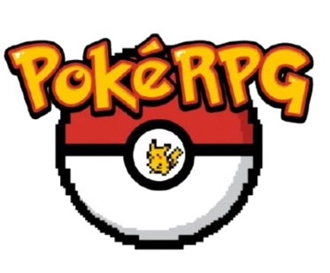

<p align="center"></p>

# PokéRPG

RPG de texto no navegador em que **você é o Pokémon**: sem treinador e sem Pokébola. Você começa como um inicial, explora as rotas de uma região (um mapa por Gen, de Kanto a Paldea), luta contra selvagens, foge de treinadores que querem te capturar, faz amigos, enfrenta os Alfas de cada rota e, no fim do mapa, os lendários daquela Gen.

Os dados vêm ao vivo da [PokéAPI](https://pokeapi.co) (1025 espécies, golpes, habilidades, evoluções), e as contas seguem as fórmulas dos jogos: stats com IV/EV e natureza, dano com STAB, tipos e crítico, estágios, status, XP por curva de crescimento e captura da Gen 3/4.

Feito em JavaScript puro (ES modules), sem build e sem dependências. Funciona offline e, com conta, salva na nuvem.

---

## Como jogar

### Começando
1. **Escolha o modo**. O principal é o **Roguelike** (abaixo).
2. **Escolha o mapa (Gen)**. No Roguelike, só os já liberados; nos outros modos, qualquer um. No Full Randomizer, o mapa também é sorteado.
3. **Escolha seu Pokémon** entre os iniciais das 9 regiões (Kanto a Paldea) ou Pikachu e Eevee. No Roguelike, também aparecem as espécies que você já desbloqueou.
4. Explore. O jogo salva sozinho.

### Roguelike (modo principal)
Cada jornada é uma run. Você começa só com os iniciais e, jogando, **desbloqueia novas espécies para as próximas runs**. Os contadores somam todas as suas jornadas Roguelike:
- derrotar **10** de uma espécie, **ou**
- fazer amizade com **5** dela, **ou**
- evoluir para ela **5 vezes** (forma do meio, como Charmeleon) ou **10 vezes** (forma final, como Charizard).

A tela inicial mostra os desbloqueados e os que estão **quase lá**, a tela de fim mostra o que aquela run liberou, e a Carreira mostra todo o progresso. Só jornadas Roguelike contam.

**Sem segunda chance:** no Roguelike, se você desmaiar, a run acaba (nem Revive salva). Se um **aliado** desmaiar, ele é **perdido para sempre**, e o Centro não traz de volta. Ser capturado também encerra a run. O Centro é pago (com desconto por vitória) e você começa no nível 5.

**Vencer a run:** vença os **lendários da última rota** do mapa. A run termina em vitória e o **mapa da Gen seguinte** fica liberado para as próximas runs (Gen 1 → Gen 2 → … → Gen 9).

### Todos os modos

| Modo | Treinador te captura? | Centro Pokémon | Desmaios | Na criação | Pontos |
|---|---|---|---|---|---|
| **Roguelike** | sim: **fim da run** | pago, −10% por vitória | **nenhum**: desmaiou, acabou; aliado desmaiado é perdido | nível 5; iniciais + desbloqueados | ×1,5 |
| **Fácil** | nunca | grátis | ilimitados | escolhe tudo | ×1 |
| **Médio** | nunca | pago, −10% por vitória desde a última visita | 3 livres, depois gasta Revive | escolhe tudo | ×1,2 |
| **Difícil** | sim: você foge depois, sem a mochila e com metade do dinheiro | pago | 3 livres, depois Revive | nível 5 | ×1,5 |
| **Hardcore** | sim: **fim de jogo** | pago | 3 livres, depois Revive | nível 5, natureza e habilidade sorteadas | ×2 |
| **🎲 Full Randomizer** | como no Difícil | pago | 3 livres, depois Revive | tudo sorteado, até a espécie | ×1,5 |

Sem Revive depois do 3º desmaio (Médio para cima), é **Game Over**.

### O mundo
- **Um mapa por Gen** (Kanto, Johto, Hoenn, Sinnoh, Unova, Kalos, Alola, Galar, Paldea), cada um com **10 rotas** que abrem por nível (do 2 ao ~62). Os selvagens de cada mapa são os daquela Gen, cada um na rota que combina com o nível e o tipo dele. Nenhuma rota tem todos os Pokémon: para achar todos, você passa pelos vários mapas.
- **Taxa de aparição:** comuns aparecem mais, raros menos (pela taxa de captura da espécie). **Míticos** da Gen (Mew, Celebi…) podem aparecer nas duas rotas mais altas, bem raramente (~0,4% dos encontros).
- **Pokédex da rota:** cada espécie da rota aparece como **?** até você enfrentá-la. Depois de enfrentar, vira **silhueta**. Com **10 derrotados** (somando todas as suas jornadas), aparece colorida e com a **taxa de aparição** naquela rota.
- **Alfas:** cada rota tem um chefe mais forte que o normal (HP ×2, +30% no resto, IVs perfeitos). Prêmio na primeira vitória.
- **Lendários:** a última rota de cada mapa guarda os lendários da Gen. Você enfrenta até 4 em sequência, e o principal (Mewtwo, Ho-Oh, Rayquaza…) vem por último, turbinado. Vencer **fecha a Gen**:
  - no Roguelike, a run termina em vitória e libera o mapa seguinte;
  - nos outros modos, você **escolhe o próximo mapa** (qualquer Gen) e segue com a mesma equipe. Os níveis do mapa novo começam no seu e sobem até o 100.
- **Treinadores caçadores:** aparecem explorando, com 1 a 3 Pokémon e Pokébolas. Com seu HP pela metade, podem tentar te capturar, e a chance depende da taxa de captura da **sua** espécie.
- **Shiny:** 1 em 4096, para você e para qualquer Pokémon que aparecer.
- **Centro Pokémon, loja e mochila:** Potion, curas de status, Ether, X-itens, Rare Candy, Revive e petiscos.

### Batalha
- Turnos com barra de "quem está agindo", prioridade e velocidade, precisão e evasão, crítico, status (queimado, envenenado, paralisado, dormindo, congelado, confuso) e dano residual.
- **~60 habilidades com efeito de verdade**, iguais no single player e no multiplayer:
  - **Ataque:** Overgrow/Blaze/Torrent/Swarm, Adaptability, Technician, Huge Power, Hustle, Guts, Sniper, Tinted Lens, Skill Link, Serene Grace, Rock Head.
  - **Defesa:** Thick Fat, Filter, Multiscale, Sturdy, Wonder Guard.
  - **Absorção de tipo:** Levitate, Flash Fire, Volt/Water Absorb, Lightning Rod, Motor Drive, Sap Sipper.
  - **Status:** Immunity, Limber, Insomnia, Own Tempo.
  - **Atributos que não caem:** Clear Body, Hyper Cutter.
  - **Contato:** Static, Flame Body, Rough Skin.
  - **Fim de turno:** Speed Boost, Shed Skin.
  - **Outras:** Intimidate, Run Away…

  A ficha marca quais estão ativas.

### Amizade e aliados
- Em batalha contra um selvagem, ofereça um **petisco** que o tipo dele goste. Com a amizade cheia, ele passa a te seguir (até **2 aliados**). São 6 petiscos que cobrem os 18 tipos.
- Aliados lutam **junto com você** no mesmo turno, ganham XP, aprendem golpes e evoluem.
- **Ordens:** À vontade · Pegar leve (não derruba quem você quer fazer de amigo) · Só status · Não atacar · Descansar (fora da batalha).
- Itens podem ser usados em qualquer um da equipe, e o Revive reanima um aliado.

### Missões
36 missões que vão aparecendo conforme você joga: derrotar espécies (mais para as comuns, menos para as raras), fazer amigos, vencer a trilha dos Alfas (a de Kanto só aparece no mapa da Gen 1), juntar e gastar dinheiro, subir de nível, evoluir e derrotar treinadores.

### Fim de jornada e carreira
- **💾 Jornadas salvas:** dá para ter várias runs em andamento. Em **Novo jogo**, escolha **Guardar e começar outra** (nada se perde) ou **Encerrar**. A tela 💾 Jornadas salvas lista todas, com **Continuar** e **Excluir**. Com conta, todas ficam na nuvem. Quando chega uma jornada de outro aparelho, você escolhe **Continuar**, **Guardar pra depois** (fica na lista e não pergunta de novo) ou **Excluir**. Até 12 guardadas.
- A jornada termina com Game Over, com vitória (Roguelike: venceu os lendários) ou quando você a encerra (**Novo jogo**). A tela de fim compara tudo com o seu recorde naquela espécie. Cada Gen fechada vale **2000 pontos**.
- **📊 Carreira:** Pokémon favorito, Pokédex (quantos já viraram amigos e quantos faltam dos 1025, além dos vistos), shinies, maior quantia de dinheiro, mais missões numa jornada, nível máximo, tempo total e o melhor resultado por espécie.

### 👥 Multiplayer: co-op e PvP
Um jogador cria a sala e passa o **código de 4 letras**; até 6 entram com ele. Não precisa de conta. O anfitrião escolhe:
- **Modo:**
  - **Co-op:** chama amigos para a sua run. Todos juntos contra selvagens (um por jogador) ou contra o **Alfa** da zona (que aguenta o grupo todo).
  - **PvP:** cada um escolhe o **Time A** ou o **Time B**. Dá para fazer 1×1, 2×2, 3×3, 2×1, 3×2…
- **Pokémon por jogador:** 1 (só o principal) ou 2 a 3 (com os seus aliados).
- **Balancear (ligado por padrão):**
  - **Co-op:** o grupo todo fica no nível do Pokémon do anfitrião, então um amigo forte não atropela a sua run.
  - **PvP:** todos no nível médio da luta, e o time em menor número ganha HP extra.
  - **Desligado:** níveis reais. No co-op os inimigos acompanham o mais forte do grupo, então é mais difícil.

**Com qual Pokémon entrar:** o **da sua run** (a luta conta para ela) ou um **convidado**. O convidado é escolhido entre os iniciais, Pikachu, Eevee e as espécies desbloqueadas no Roguelike; é emprestado só para a sala e não mexe em nada. Sem run em andamento, dá para entrar com um convidado direto da tela inicial.

**Ganhos da run de outra pessoa:** se você lutou no **seu nível real**, **XP, EVs, dinheiro, itens** (35% de chance por vitória) e prêmios de Alfa **voltam com você** para a sua run. Se o Balancear ajustou o seu nível, a luta vale como diversão e não leva ganhos.

Cada um escolhe o golpe e o alvo de cada Pokémon seu. O turno sai quando todos escolherem, ou em 45 segundos, no automático.
- **Co-op:** XP, EVs e dinheiro vão para a jornada de cada um, e o HP e o PP gastos voltam junto. Fora do Roguelike, desmaiar volta com 1 de HP; **no Roguelike, desmaiar conta de verdade**.
- **PvP:** é amistoso. Não gasta HP nem PP, só conta vitórias e derrotas. Dá para **desistir**.

### 👤 Ícone e amigos
- **Ícone:** qualquer um dos 1025 Pokémon, normal ou ✨ shiny. Aparece no topo, no ranking, nas salas e para os seus amigos. Sem conta, fica só no seu navegador.
- **Amigos** (com conta): cada um tem um **código de amigo** de 6 caracteres. Adicione pelo código, e o outro aceita ou recusa. Na sala multiplayer, o anfitrião **chama um amigo com um toque**, e ele recebe o convite em qualquer tela do jogo.

### 🐞 Bugs e sugestões
Na tela inicial e no topo do jogo. Escolha **Bug** ou **Sugestão**, dê um título e descreva. Não precisa de conta. Os bugs podem levar um **anexo técnico** (versão, navegador, tela, Pokémon, últimas linhas do registro, **nada pessoal**), que você vê antes de enviar. Sem internet, fica guardado e é enviado depois.

### 🏆 Ranking global
A melhor jornada de cada jogador, **geral** ou **por espécie**, com a sua posição destacada. Dá para ver sem conta; para aparecer, entre e termine jornadas. A pontuação é **recalculada no servidor** a partir dos números da jornada, e números impossíveis são recusados.

### Tela
Os painéis (Ficha, Missões, Aliados, Mochila, Registro) podem ser **arrastados, redimensionados, recolhidos e trocados de coluna**. A cena da batalha fica fixa no centro. Botão **↺ Layout** volta ao padrão. No celular vira uma coluna só.

### Offline e nuvem
- **Offline:** depois do primeiro acesso online, o jogo abre e roda sem internet. Os encontros saem entre os Pokémon que já estão salvos no aparelho, e tudo o que precisa ir para a nuvem sobe quando a internet volta.
- **Conta** (Google ou link por e-mail): a carreira e a **jornada em andamento** ficam na conta. Dá para continuar em outro aparelho. O que você jogou antes de entrar sobe no primeiro login.

---

## Rodando localmente

ES modules não carregam por `file://`, então é preciso um servidor:

```
python -m http.server 3000
```

Depois abra http://localhost:3000.

**Login e nuvem (opcional):** siga [`supabase/COMO-CONFIGURAR.md`](supabase/COMO-CONFIGURAR.md). Sem isso, o jogo funciona inteiro, só que local.

**Publicar:** qualquer hospedagem estática (usamos a Vercel), com a raiz do repositório como pasta pública e sem comando de build.

## Testes

`node --test` (sem caminho) roda `tests/*.test.js`: fórmulas de batalha, captura, missões, carreira, layout dos painéis, sanidade das tabelas de dados e a lista de arquivos do modo offline. O GitHub Actions roda os testes a cada push (aba **Actions**).

## Estrutura

| Pasta/arquivo | O que tem |
|---|---|
| `index.html`, `css/estilo.css` | Página e estilo |
| `js/regras.js` | Fórmulas puras (dano, stats, captura, missões, pontuação…), todas testadas |
| `js/dados.js` | Tabelas: tipos, naturezas, itens, missões, dificuldades, iniciais, ordens |
| `js/mapas.js`, `js/dados-mapas.js` | Mapas por Gen: rotas, taxas de aparição, Alfas, lendários, Pokédex da rota. `dados-mapas.js` é **gerado** da PokéAPI por `ferramentas/gerar-mapas.ps1` (não editar à mão) |
| `js/golpe.js`, `js/habilidades.js`, `js/especiais.js` | Motor único dos golpes, a tabela de habilidades e a de golpes especiais (Protect, Rest, Explosion, carga/recarga…) |
| `docs/auditoria-batalha.md` | Auditoria de todos os golpes e habilidades contra o motor: o que funciona, o que é aproximado e o que falta |
| `js/relatos.js` | Bugs e sugestões |
| `js/batalha.js`, `js/amizade.js`, `js/progressao.js`, `js/itens.js`, `js/missoes.js`, `js/mundo.js` | Regras narradas do jogo |
| `js/render.js`, `js/paineis.js`, `js/layout.js` | Tela e painéis modulares |
| `js/criacao.js`, `js/fim.js`, `js/carreira.js`, `js/roguelike.js` | Criação, fim de jornada, carreira e desbloqueios do Roguelike |
| `js/nuvem.js`, `js/conta.js`, `js/config.js`, `js/ranking.js` | Login, nuvem (Supabase) e ranking global |
| `js/saves.js`, `js/tela-saves.js` | Jornadas salvas (várias runs em andamento) e a tela delas |
| `js/mp-motor.js`, `js/multiplayer.js` | Motor da batalha multiplayer (puro, testado) e salas |
| `sw.js` | Modo offline |
| `supabase/` | Banco (`schema.sql`) e passo a passo de configuração |
| `CLAUDE.md` | Mapa técnico detalhado (para quem mexe no código) |

---

## Próximos passos

- [ ] **Evoluções especiais**, porque hoje só a evolução por nível funciona:
  - **pedras e itens** (loja e achados, usados pela Mochila);
  - **troca:** "Cabo de Conexão" no single player, e troca de verdade com um amigo no multiplayer;
  - **condições:** amizade (vínculo), dia ou noite pelo relógio real, saber um golpe, estar numa zona.
- [ ] **Batalha mais completa**, nesta ordem:
  1. ~~Habilidades~~ ✔ (mais delas vão entrando aos poucos: cada uma é uma linha na tabela).
  2. **Clima:** sol, chuva, tempestade de areia e granizo/neve, e as habilidades ligadas a eles.
  3. **Terrenos:** elétrico, grama, psíquico e névoa.
  4. **Itens segurados:** Leftovers, Choice, Life Orb, frutas…
  5. **Golpes especiais:** a primeira leva já está feita (proteção, dois turnos, recarga, fúria, nocaute de um golpe, poder variável…). Faltam os de lado do campo (Light Screen, Stealth Rock), os que travam golpes (Taunt, Encore, Disable), os de troca (Roar, Baton Pass) e uma IA de inimigo mais esperta. A lista completa está em `docs/auditoria-batalha.md`.
  6. **Mecânicas especiais:** Mega Evolução, Z-Moves, Dynamax/Gigantamax e Terastalização.
- [ ] **Mapas por Gen, próximos passos:** missões próprias de cada mapa (hoje as de espécie valem em qualquer mapa, e a trilha de Alfas é só de Kanto) e a luta dos lendários no co-op (hoje é só no single player).
- [ ] Acabamento: sons, animações e instalação como app (PWA).

### Já feito
- [x] Módulos, testes e CI
- [x] Treinadores caçadores, dificuldades, shiny, Full Randomizer
- [x] Amizade, aliados com ordens, batalha com vários do mesmo lado
- [x] Zonas por nível, Alfas, missões
- [x] 💾 Jornadas salvas: várias runs em andamento (guardar, continuar, excluir), na nuvem também
- [x] Mapas por Gen (9 regiões × 10 rotas), lendários no fim de cada mapa, míticos raros, Pokédex da rota com silhuetas e taxa de aparição
- [x] Game Over, carreira, Revive
- [x] Painéis modulares
- [x] Login (Google / e-mail), carreira e jornada na nuvem, modo offline
- [x] Roguelike com desbloqueio de espécies e evoluções entre runs
- [x] Ranking global (geral e por espécie), com pontuação conferida no servidor
- [x] Multiplayer co-op e PvP (1×1 a 3×3, times desiguais, com aliados), sala por código, balanceamento de nível
- [x] Roguelike sem segunda chance (permadeath de você e dos aliados)
- [x] Entrar numa sala com um Pokémon convidado; ganhos da run de outra pessoa voltam com você (no nível real)
- [x] Ícone do jogador (qualquer Pokémon, normal ou shiny), amigos por código e convite direto para a sala
- [x] Motor de golpes único (single player e multiplayer) com ~60 habilidades
- [x] Tela de bugs e sugestões (funciona sem conta e offline)
- [x] Menu ☰ no celular e tela de login com Google / link por e-mail
- [x] Auditoria de todos os golpes e habilidades; primeira leva de golpes especiais corrigida (Protect, Endure, Focus Energy, Rest, Explosion, Toxic, Leech Seed, Dream Eater, OHKO, Fly/Dig/Solar Beam, Hyper Beam, Outrage, Flail/Eruption/Hex…)
