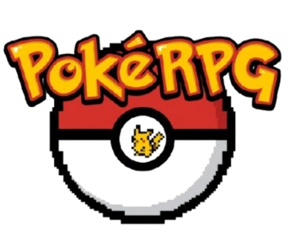

<p align="center"></p>

# PokéRPG

RPG no navegador em que **você é o Pokémon**: sem treinador e sem Pokébola. Você começa como um inicial, explora as rotas de uma região (um mapa por Gen, de Kanto a Paldea), luta contra selvagens, foge de treinadores que querem te capturar, faz amigos, enfrenta os Alfas de cada rota e, no fim do mapa, os lendários daquela Gen.

Os dados vêm ao vivo da [PokéAPI](https://pokeapi.co) (1025 espécies, golpes, habilidades, evoluções), e as contas seguem as fórmulas dos jogos: stats com IV/EV e natureza, dano com STAB, tipos e crítico, estágios, status, XP por curva de crescimento e captura da Gen 3/4.

Feito em JavaScript puro (ES modules), sem build e sem dependências. Funciona offline e, com conta, salva na nuvem.

---

## Como jogar

### Começando
1. **Escolha o modo**. O principal é o **Roguelike** (abaixo).
2. **Escolha o mapa (Gen)**. No Roguelike, só os já liberados; nos outros modos, qualquer um. No Full Randomizer, o mapa também é sorteado.
3. **Escolha seu Pokémon** entre os iniciais das 9 regiões (Kanto a Paldea), Pikachu e Eevee, **mais todas as espécies que você já desbloqueou**. O desbloqueio só é conquistado jogando Roguelike, mas a espécie desbloqueada vale em qualquer modo.
4. Explore. O jogo salva sozinho.

### ❓ Tutorial (tour guiado)
Na primeiríssima vez que o jogo abre neste aparelho (sem nenhum save ainda), ele mostra um tour rápido antes da criação: explica que você é o Pokémon (não um treinador), e faz você **abrir a loja e comprar um item**, **lutar** contra um Pokémon selvagem de demonstração, ver o que acontece quando um **treinador tenta te capturar** (e como isso muda por dificuldade) e termina com um resumo do que é uma **Run**. É pulável a qualquer momento e não mexe em nenhum save de verdade — o Pokémon e o dinheiro do tour são só de mentirinha. Dá para rever quando quiser no botão **❓ Tutorial**, disponível em qualquer tela (menu ☰ no celular).

### Roguelike (modo principal)
Cada jornada é uma run. Você começa só com os iniciais e, jogando, **desbloqueia novas espécies para as próximas runs**. Os contadores somam todas as suas jornadas Roguelike:
- derrotar **10** de uma espécie, **ou**
- fazer amizade com **5** dela, **ou**
- evoluir para ela **5 vezes** (forma do meio, como Charmeleon) ou **10 vezes** (forma final, como Charizard).

A tela inicial e a tela 🏅 Conquistas mostram os desbloqueados e os que estão **quase lá**, e a tela de fim mostra o que aquela run liberou. **Só jornadas Roguelike contam para desbloquear** — mas a espécie desbloqueada pode ser usada em todos os modos.

**Rota esgotada:** no Roguelike, quando o seu nível passa do **dobro do teto de uma rota**, ela para de dar encontros — nada de farmar em rota fraca. Você continua entrando e vendo a Pokédex dela.

**Sem segunda chance:** no Roguelike, se você desmaiar, a run acaba (nem Revive salva). Se um **aliado** desmaiar, ele é **perdido para sempre**, e o Centro não traz de volta. Ser capturado também encerra a run. O Centro é pago (com desconto por vitória) e você começa no nível 5.

**Vencer a run:** vença os **lendários da última rota** do mapa. A run termina em vitória e o **mapa da Gen seguinte** fica liberado para as próximas runs (Gen 1 → Gen 2 → … → Gen 9).

### Todos os modos

| Modo | Treinador te captura? | Centro Pokémon | Desmaios | Na criação | Pontos |
|---|---|---|---|---|---|
| **Roguelike** | sim: **fim da run** | pago, −10% por vitória | **nenhum**: desmaiou, acabou; aliado desmaiado é perdido | nível 5; iniciais + desbloqueados | ×1,5 |
| **Fácil** | nunca | grátis | ilimitados | escolhe tudo | ×1 |
| **Médio** | nunca | pago, −10% por vitória desde a última visita | 3 livres, depois gasta Revive | escolhe tudo | ×1,2 |
| **Difícil** | sim: você foge depois, sem a mochila e com metade do dinheiro | pago | 3 livres, depois Revive | nível 5 | ×1,5 |
| **Hardcore** | sim: **fim de jogo** | pago | 3 livres, depois Revive | nível 5, natureza e habilidade sorteadas | ×2 |
| **🎲 Full Randomizer** | como no Difícil | pago | 3 livres, depois Revive | tudo sorteado, até a espécie | ×1,5 |

Sem Revive depois do 3º desmaio (Médio para cima), é **Game Over**.

### O mundo
- **Um mapa por Gen** (Kanto, Johto, Hoenn, Sinnoh, Unova, Kalos, Alola, Galar, Paldea), cada um com **10 rotas** que abrem por nível (do 2 ao ~62). Os selvagens de cada mapa são os daquela Gen, cada um na rota que combina com o nível e o tipo dele. Nenhuma rota tem todos os Pokémon: para achar todos, você passa pelos vários mapas. **Os iniciais das nove regiões (e as evoluções deles) não aparecem nas rotas comuns** — escolher o seu no começo da jornada é o que dá acesso a eles. Pikachu e Eevee são exceção: continuam aparecendo no mundo.
- **No Roguelike, vencer não encerra na marra:** ao derrotar os lendários, a vitória já fica garantida (o mapa seguinte libera) e você escolhe entre encerrar a run ou continuar no Santuário. Se seguir e desmaiar lá, a run acaba em derrota — mas a Gen vencida continua liberada. Lendários e míticos do Santuário aceitam petisco e podem virar aliados, só que confiam bem mais devagar.
- **🏛 Santuário (11ª área, só depois de vencer):** quando você derrota os lendários de um mapa, abre o Santuário daquela região. Lá vive **a Gen inteira** — todas as espécies, com as linhas evolutivas completas, mais os iniciais, os lendários, os míticos e as **formas regionais** (Alolan, Galarian, Hisuian, Paldean). A raridade de cada um segue a dificuldade de captura da espécie, como no resto do jogo. É a garantia de que dá para encontrar todo Pokémon de uma Gen — depois de fechá-la.
- **Evoluir dentro da região dá a forma de lá:** um Exeggcute que evolui em Alola vira o Exeggutor de Alola, não o de Kanto — vale para Alola, Galar, Hisui e Paldea, em qualquer espécie que tenha forma regional naquele mapa. O registro continua contando na espécie, então Pokédex e desbloqueios não mudam; o que muda é o Pokémon que fica com você, com os tipos, os status e os golpes da forma regional.
- **Taxa de aparição:** comuns aparecem mais, raros menos (pela taxa de captura da espécie). **Míticos** da Gen (Mew, Celebi…) podem aparecer nas duas rotas mais altas, bem raramente (~0,4% dos encontros).
- **Pokédex da rota:** cada espécie da rota aparece como **?** até você enfrentá-la. Depois de enfrentar, vira **silhueta**. Com **10 derrotados** (somando todas as suas jornadas), aparece colorida e com a **taxa de aparição** naquela rota.
- **Alfas:** cada rota tem um chefe mais forte que o normal (HP ×2, +30% no resto, IVs perfeitos). Prêmio na primeira vitória.
- **Lendários:** a última rota de cada mapa guarda os lendários da Gen. Você enfrenta até 4 em sequência, e o principal (Mewtwo, Ho-Oh, Rayquaza…) vem por último, turbinado. Vencer **fecha a Gen**:
  - no Roguelike, a run termina em vitória e libera o mapa seguinte;
  - nos outros modos, a jornada **termina em vitória** e o seu Pokémon **se aposenta campeão** daquele mapa: a próxima jornada começa do zero na Gen seguinte, com outro Pokémon no nível 5 e o mapa nos níveis normais dele. Se preferir, dá para **seguir com o mesmo Pokémon** (aí você leva equipe e mochila, e o mapa novo se ajusta ao seu nível) — mas cada continuação vale **20% menos pontos**, com piso de metade.
- **Treinadores caçadores:** aparecem explorando, com 1 a 3 Pokémon e Pokébolas. A equipe deles **não é só da rota**: cerca de metade pode ser qualquer espécie daquele mapa, sempre no nível da rota — eles viajaram até ali. Com seu HP pela metade, podem tentar te capturar, e a chance depende da taxa de captura da **sua** espécie.
- **Shiny:** 1 em 4096, para você e para qualquer Pokémon que aparecer.
- **Gênero (♂/♀):** sorteado ao nascer pela proporção real de cada espécie — quem não tem gênero (Magnemite, Voltorb, a maioria dos lendários) continua sem. Aparece na plaquinha de batalha, na ficha e no cartão da sala, e **muda o jogo**: Atração e Charme Fofo só apaixonam o gênero oposto, Cativar só funciona nele, Rivalidade bate mais forte contra o mesmo gênero e mais fraco contra o oposto, e Vespiquen, Salazzle, Froslass e Wormadam só saem de fêmeas (Mothim, só de machos).
- **Centro Pokémon, loja e mochila:** Potion, Super/Hyper, **Mega Potion (50%), Max Potion e Full Restore** (curam por % do HP máximo, pra acompanhar o nível 100), curas de status, Ether/Max Ether, X-itens, Rare Candy, Revive/Max Revive e petiscos.

### Batalha
- Turnos com barra de "quem está agindo", prioridade e velocidade, precisão e evasão, crítico, status (queimado, envenenado, paralisado, dormindo, congelado, confuso) e dano residual.
- **Apaixonado:** Atração (e o Charme Fofo de quem você encosta) deixa o alvo sem atacar em metade dos turnos — só vale entre gêneros opostos, e **Oblivious e Aroma Veil não caem nessa**.
- **Congelado derrete:** 20% de chance de sair sozinho por turno, mas **golpe de Fogo descongela quem leva**, **golpe quente (Roda de Fogo, Fogo Sagrado, Investida Flamejante, Água Fervente, Bola de Fogo…) descongela quem usa** — e no **sol forte ninguém congela**.
- As **barras de HP e XP animam** ao mudar de valor, e o **PP pisca** quando muda — nada salta direto pro número novo. Quem apanha **treme e pisca na cor do tipo do golpe** (fogo acende laranja, água acende azul; dano sem tipo fica no vermelho) e quem ataca dá um pulinho. Tudo isso respeita a preferência de "reduzir animações" do aparelho e pode ser desligado em **⚙ Ajustes → Som e animações** — desligado, o combate também fica mais rápido, porque a pausa entre as mensagens existia pra dar tempo de ver a animação.
- **Cena mais viva**: quem ataca dá um pulo, quem apanha pisca vermelho, quem se cura pisca verde, e status (queimado, envenenado, paralisado, congelado) e mudanças de atributo pulsam sutilmente enquanto durarem.
- **Mais de 200 habilidades com efeito de verdade**, iguais no single player e no multiplayer (Intimidate e as outras de "entrar em campo" agora também valem no multiplayer):
  - **Ataque:** Overgrow/Blaze/Torrent/Swarm, Adaptability, Technician, Huge Power, Hustle, Guts, Toxic Boost, Flare Boost, Sniper, Tinted Lens, Skill Link, Serene Grace, Rock Head, Reckless, Neuroforce, Merciless, Defeatist, Iron Fist, Strong Jaw, Sharpness, Steelworker, Transistor, Dragon's Maw, Rocky Payload, Water Bubble, Sand Force.
  - **Defesa:** Thick Fat, Filter, Multiscale, Sturdy, Wonder Guard, Unaware, Wonder Skin, Dazzling/Queenly Majesty/Armor Tail (barram golpe de prioridade), Pressure, Soundproof (imune a golpe sonoro), Bulletproof (imune a golpe de bala/bola).
  - **Absorção de tipo:** Levitate, Flash Fire, Volt/Water Absorb, Lightning Rod, Motor Drive, Sap Sipper.
  - **Status:** Immunity, Limber, Insomnia, Own Tempo, Poison Heal, Magic Guard (nenhum dano indireto), Cute Charm e Rivalry (gênero).
  - **Atributos:** Clear Body, Hyper Cutter, Contrary, Simple, Mirror Armor, Defiant, Competitive.
  - **Reagem a levar golpe:** Steam Engine, Water Compaction, Stamina, Weak Armor, Justified, Rattled, Anger Point, Sand Spit, Seed Sower.
  - **Contato:** Static, Flame Body, Rough Skin, Effect Spore (sono, paralisia ou veneno), Gooey, Tangling Hair, Poison Touch.
  - **Ao derrubar:** Moxie, Chilling Neigh, Grim Neigh.
  - **Ao entrar em campo:** Intimidate (com Guard Dog, Inner Focus, Own Tempo e Oblivious reagindo), Download (lê a defesa do oponente), Hadron Engine, Orichalcum Pulse, Anticipation (avisa se algum oponente tem golpe perigoso).
  - **Fim de turno:** Speed Boost, Shed Skin, Moody (sorteia um atributo que sobe e outro que cai). **Clima/terreno com maior atributo:** Protosynthesis (sol), Quark Drive (Campo Elétrico). **Outras:** Truant, Run Away, Magnet Pull (prende quem é do tipo Aço), Shadow Tag/Arena Trap (prendem qualquer um, Arena Trap só quem está no chão), Synchronize (devolve queimadura/paralisia/veneno pra quem causou), Stench (chance extra de fazer recuar), Sheer Force (golpe com efeito secundário bate mais forte, mas perde o efeito), Unnerve (trava a fruta que o oponente comeria sozinho), Friend Guard (reduz o dano que um aliado recebe).
  - **Leva de 28/09/2026 (43 habilidades):** Tough Claws/Mega Launcher/Punk Rock (dano extra por golpe de contato/aura/som), Aerilate/Pixilate/Refrigerate/Galvanize (viram golpe Normal noutro tipo, com bônus de poder) e Normalize (tudo vira Normal), Tangled Feet (dobra a evasão confuso), Prankster/Gale Wings/Triage (prioridade extra em status/Voador com HP cheio/cura), Quick Draw e Stall (agem primeiro ou por último dentro da própria prioridade, como a Garra Rápida ao contrário), Long Reach (nunca faz contato), Battery/Power Spot/Steely Spirit/Plus/Minus (reforçam o golpe de um aliado), Beast Boost (sobe o maior atributo ao derrubar), Aftermath e Innards Out (quem derruba sofre também), Liquid Ooze (dreno vira dano em quem drenou), Pickpocket/Magician/Sticky Hold (roubam item ao acertar, ou protegem o seu), Good As Gold (imune a golpe de status alheio), Corrosion (envenena até Aço/Venenoso), Flower Veil (protege aliados de tipo Grama de queda de atributo e status), Trace (copia a habilidade do oponente ao entrar), Forewarn/Frisk (avisam o golpe mais forte/o item do oponente), Ripen/Cheek Pouch (fruta cura mais), Klutz (item sem efeito nenhum em batalha), Cotton Down (quem te acerta perde Velocidade), Mummy/Lingering Aroma/Wandering Spirit (contagiam ou trocam habilidade ao encostar).

  A ficha marca quais estão ativas.

### No celular
Na batalha, a **cena fica presa no topo** (os dois lados, com HP e status de toda a equipe) enquanto você rola o resto da página: golpes, registro, ficha, aliados, missões e mochila continuam todos ali, um embaixo do outro. Nada fica escondido atrás de aba nenhuma — você vê o Pokémon enquanto escolhe o golpe e alcança a ficha de qualquer aliado sem sair da luta.

**Celular deitado:** a cena da luta fica **grudada na lateral esquerda**, da altura inteira da tela e **sempre visível** (em vez de presa no topo, que sobraria pouca altura numa tela baixa) — golpes, registro e painéis ficam numa coluna à direita, que rola por baixo dela sem nunca levar a batalha embora. Os botões de golpe ali são mais baixos e ficam **2 em cima e 2 embaixo**.

### 🎯 Caça Shiny
Modo opcional, ligado **no começo da jornada**. Quando você revela todas as espécies de uma rota (10 derrotados de cada), pode escolher **uma delas para ser a única que aparece ali** — bom para caçar um shiny ou farmar uma espécie. Dá para trocar ou parar a caça quando quiser, rota por rota. **Muda só o Pokémon selvagem:** treinadores, itens, dinheiro e as frases de ambientação continuam com a mesma chance.

### Repelentes (loja)
- **Repelente Seletivo** (30 explorações): você escolhe **a única espécie da rota que não é repelida** — só ela aparece.
- **Repelente Total** (40 explorações): **nenhum selvagem** aparece; você continua encontrando treinadores, itens e dinheiro normalmente.

### Jogar offline
Depois do primeiro acesso o jogo abre sem internet, e guarda sozinho tudo o que você encontra. Em **⚙ Ajustes → Jogar offline** dá para **baixar um mapa inteiro de uma vez** — ou **o jogo inteiro**, com os nove mapas (Pokémon, golpes e sprites) — para que nada apareça sem imagem quando você estiver sem rede. A tela mostra quanto de cada mapa já está guardado e quanto espaço isso ocupa no aparelho. O download do jogo todo passa de 100 MB e leva alguns minutos: use uma rede boa e deixe a tela aberta.

### 🧊 Estilo de sprite
Em **⚙ Ajustes → Sprites**, escolha entre três estilos: **Clássico** (pixel-art de sempre), **3D** (o render usado em Pokémon HOME e nos jogos mais recentes — mesmo modelo 3D, só que renderizado em 2D; sem versão de costas, então na batalha o seu Pokémon aparece de frente também, igual já acontece hoje com espécies sem sprite de costas clássico) e **Animado** (os GIFs do Pokémon Showdown, com versão de costas de verdade). Se algum Pokémon ou forma não tiver a imagem do estilo escolhido, a tela cai sozinha de volta pro sprite clássico. Download **opcional e separado** do download normal, em ⚙ Ajustes → Jogar offline — 3D baixa 2 imagens por Pokémon (frente normal e shiny), Animado baixa 4 (frente e costas, normal e shiny). *(Corrigido: os GIFs animados não têm todos o mesmo formato — antes a imagem esticava pra caber na caixa; agora ela encolhe proporcionalmente, sem distorcer.)*

### Itens segurados
Cada Pokémon da equipe pode segurar **um item**, que age sozinho na batalha. Para equipar: **loja → 🎒 Para segurar**, e depois "Segurar" na mochila (ou direto pelo atalho na ficha). **Nada disso precisa de dinheiro:** explorando, as **frutas** caem em qualquer rota (cerca de 1 em 6 dos itens achados — são 20 contando as 17 de aperto por tipo, então cada uma continua sendo sorte) e os **segurados permanentes** (Restos, Orbe da Vida, Faixa Escolha…) caem **da 4ª rota em diante**, no mesmo degrau dos itens de evolução. Só os itens de **prêmio de raide** não aparecem no chão — esses continuam sendo de vencer o chefe da semana. A ficha mostra o que cada um leva, com botão para guardar de volta.
- **Restos** (cura 1/16 por turno), **Lodo Negro** (cura Venenosos, machuca o resto), **Sino-Concha** (drena 1/8 do dano que você causa).
- **Orbe da Vida** (+30% de dano, custa 10% do seu HP por golpe), **Faixa Muscular** (+10% físico), **Óculos do Sábio** (+10% especial), **Cinto do Perito** (+20% em super efetivo).
- **Faixa de Foco** (com HP cheio, sobra com 1 de HP; gasta-se), **Elmo Rochoso** (quem te acerta no físico perde 1/6), **Colete de Assalto** (+50% de Defesa Especial, sem golpes de status).
- **Frutas** comidas sozinhas: **Oran** e **Sitrus** quando o HP cai à metade, **Lum** ao pegar qualquer status.
- **Orbe de Fogo** e **Orbe Tóxico**: se auto-infligem queimadura/veneno grave no fim de cada turno sem status (o tipo certo é imune, como sempre). Parecem punição, mas combinam com Guts, Flare Boost, Toxic Boost, Quick Feet e Marvel Scale — todas já implementadas.
- **Garra Rápida**: 20% de chance por turno de agir primeiro dentro da própria prioridade (não fura quem tem prioridade maior).
- **Faixa/Óculos/Lenço Escolha**: Ataque, At. Especial ou Velocidade +50%, mas trava no primeiro golpe usado (os outros ficam desabilitados na tela) até você desmaiar ou ser revivido.
- **Bola de Ferro**: Velocidade -50%.
- **Eviolite**: Defesa e Defesa Especial +50%, só em espécies que ainda podem evoluir (Pichu, Scyther, Eevee…) — em forma final, não faz nada.
- **Balão de Ar**: você flutua — golpes Terrestres não te alcançam e o terreno não te afeta. Estoura no primeiro golpe que te acertar.
- **Apólice de Fraqueza**: ao levar um golpe super efetivo, Ataque e At. Especial sobem 2 níveis de uma vez. Gasta-se.
- **Lente de Mira**: +1 nível de crítico nos seus golpes.
- **Erva Branca** (desfaz a primeira queda de atributo), **Erva Mental** (livra na hora de Provocação, Bis, Desativar ou Tormento) e **Erva do Poder** (Solar Beam, Fly, Dig e companhia saem sem o turno de carga). Todas se gastam no uso.
- **Itens de evolução que também servem na mão** — como nos jogos, são **um item só com duas funções**: **Pedra do Rei** e **Presa Afiada** (10% de chance de fazer o alvo recuar), **Garra Afiada** (+1 nível de crítico), **Revestimento Metálico** (golpes de Aço +20%) e **Dente/Escama Abissal** (dobram At./Def. Especial, só no Clamperl). Eles continuam em **💎 Evolução** na mochila e continuam evoluindo quem sempre evoluíram — e a evolução funciona com o item na mochila **ou na mão**, então equipar não trava mais nada.
- **Frutas de aperto por tipo** (17): **Occa** contra Fogo, **Passho** contra Água, **Wacan** contra Elétrico, **Yache** contra Gelo… cortam pela metade **um** golpe super efetivo daquele tipo e se gastam. São a rede de segurança contra aquele golpe que te derrubaria de uma vez.
- **Pedra Mega**, **Cristal Z** e **Vínculo de Batalha** mostram, na mochila e na loja, a pedra/cristal de verdade da sua espécie/tipo (quando existe na PokéAPI) em vez do ícone genérico — Charizard vê a Charizardita, um golpe de Fogo conquistado mostra o Cristal Ígneo, e assim por diante. Metade das Megas deste jogo (Meganium, Greninja, Zeraora…) não existe nos jogos de verdade e não tem pedra desenhada — nesses casos aparece a **Pedra-Chave**, o item real que ativa qualquer Mega Evolução.

### Mochila e loja em divisões
Os itens aparecem separados em 🧪 Cura e status · ⚔ Em batalha · 🎒 Para segurar · 💎 Evolução · 🍖 Petiscos · ✨ Especiais, tanto na mochila quanto na loja. **Na loja, cada item mostra a descrição do que faz dentro do próprio cartão** — antes isso só existia como dica ao passar o mouse, que no celular não existe.

### 🏋 Itens de treino (₽250.000 cada)
Os itens mais caros do jogo, e os únicos que mexem no que um Pokémon trouxe **de nascença**. Só na loja: não aparecem explorando nem como prêmio de Alfa.

- **Mochi do Recomeço:** zera os **EVs** de um Pokémon da equipe. Os pontos de treino que ele ganhou derrotando outros voltam a 0 e os atributos caem junto — serve pra treinar de novo do zero, em outros atributos. (A ficha mostra os EVs de cada um na coluna EV.)
- **Tampa de Garrafa:** leva **um IV ao máximo (31)**. Qual deles é **sorteado** entre os que ainda não estão em 31 — você não escolhe, e nenhuma tampa é gasta num que já está no máximo. Deixar escolher transformaria ₽1,5 milhão num Pokémon perfeito; assim cada tampa é uma aposta, e os últimos IVs custam de verdade.
- **Cápsula de Habilidade:** troca a habilidade por **outra da mesma espécie**, inclusive a **oculta**, e aqui **você escolhe** — a lista mostra o nome, o que cada uma faz e se ela já tem efeito em batalha, como na tela de criação. Espécie de habilidade única não tem pra onde trocar, e a cápsula avisa em vez de ser gasta.

Os três só funcionam fora de batalha e perguntam em quem usar quando você tem aliados.

### ⚡ Itens rápidos (até 2, com atalho de teclado)
Na mochila, o botão **⚡** de um item o coloca **junto dos botões principais da tela** — ao lado de *Explorar* fora da luta, ao lado de *Mochila* e *Fugir* dentro dela. Dá para marcar **até dois**, e eles respondem às teclas **1** e **2**. Serve para não abrir a mochila e procurar a Poção a cada turno. A escolha vale para a jornada e some se o item acabar (volta sozinha quando você comprar outro).

### Comprar em quantidade
Tocar num item da loja abre um pequeno HUD: **−10 / − / campo / + / +10 / Máx**, com o **total e o troco** atualizando na hora (limite de 99 ou o que o dinheiro alcança). Ao confirmar, aparece um aviso 🛒 "Comprou N× item" com quantos você tem na mochila. `Enter` confirma, `Esc` ou tocar fora cancela.

### Vender ou jogar fora
Cada item da mochila tem um botão **Vender** (metade do preço de compra) — ou **Jogar fora**, pra quem não tem preço de loja (achado explorando, prêmio de Alfa…). Mesmo HUD de quantidade da compra, só que ao contrário.

### ☄ Evento semanal (chefe da semana)
No **Roguelike** e no **Hardcore**, um chefe especial ocupa a rota final da Gen dele numa caixa roxa brilhante (e o sprite dele aparece na escolha de mapa). O primeiro é o **Eternatus Eternamax** (Gen 8). **Uma tentativa a cada 8 horas**, sem fuga, imune a status, e perder não encerra a jornada. *(🧪 Modo beta temporário: essa espera está desligada pros testers experimentarem a Raid com mais liberdade — volta a valer depois do teste.)*
- **Mecânicas:** *couraça de energia* (o dano cai até ela se romper; a **Ruptura** deixa o chefe exposto), *Eternabeam telegrafado* (carrega com aviso; dano suficiente no mesmo turno interrompe e ainda abre a Ruptura) e *três fases* (66% e 33% do HP).
- **Prêmio:** o Pokémon na Pokédex e para começar jornadas, a insígnia de evento com título e um prêmio por semana vencida. Na tela 👤 Conta dá para escolher **uma** insígnia para aparecer ao lado do nome.
- **Calendário:** o chefe muda **toda segunda-feira à meia-noite (Brasília)**, a partir de **28/09/2026**. Antes disso a tela inicial e a rota final mostram o aviso do primeiro chefe, e a tela inicial traz a **agenda dos próximos 3 chefes**. Semana 1 = Eternatus Eternamax (Gen 8), semana 2 = Mega Rayquaza (Gen 3), e a lista gira.
- **Mega Rayquaza:** sem couraça; o **ponto fraco muda a cada 2 ações** (só o tipo da vez machuca de verdade) e o **Dragon Ascent** carregado atinge o grupo todo.
- **Co-op:** na sala, ☄ desafia o chefe da semana em grupo. O HP cresce com o número de jogadores, mas **menos que proporcional**; o golpe carregado atinge o time inteiro; e quem ficar sem Pokémon de pé pode **usar um Revive** (até 3 por luta) enquanto os outros seguram. A insígnia escolhida aparece ao lado do nome na sala, na lista de amigos e no ranking (precisa rodar as duas migrações do Supabase de 25/09).
- **Os 16 chefes** (um por semana, depois recomeça): Eternatus Eternamax (Gen 8), Mega Rayquaza (3), Groudon Primal (3), Kyogre Primal (3), Mega Mewtwo (1), Necrozma Ultra (7), Calyrex Cavaleiro Espectral (8), Zacian Coroada (8), Kyurem Negro (5), Giratina Origem (4), Dialga Origem (4), Terapagos Estelar (9), Ursaluna Lua de Sangue (9), Zygarde Completo (6), **Arceus** (4, que troca de Prato a cada 2 ações — sorteado entre os 17, com animação do anel de tipos) e **Regigigas** (4). Cada um combina mecânicas: couraça e Ruptura, ponto fraco rotativo, golpe carregado, fases, clima permanente, tipo anulado, Mundo Reverso, adaptação de tipo, dreno, regeneração, Slow Start. A tela inicial mostra os próximos 3 chefes e, num detalhe que abre, o **calendário do ano inteiro**.
- **Itens de raide** (prêmio dos chefes, um de cada por luta): 10 **consumíveis** que só valem na luta do chefe — **Cristal de Ruptura**, **Selo de Interrupção**, **Escudo Astral**, **Cinza Vulcânica** e **Escama Abissal** (o time resiste Fogo/Água por 3 turnos), **Prisma de Luz** (expõe na hora um chefe de ponto fraco), **Espelho Reverso** (inverte a tabela de tipos nos golpes que VOCÊ dá nele por 3 ações: ajuda contra quem resiste aos seus tipos e atrapalha contra quem é fraco a eles), **Relógio de Areia** (Velocidade +2 na hora), **Fragmento Tera** (recarrega o Tera) e **Célula Zygarde** (desliga a regeneração de quem regenera) — e 7 itens **segurados** que valem em qualquer batalha (vêm só de prêmio, não se compram): **Núcleo Eternamax** (+dano Dragão/Venenoso, −Defesa), **Escama do Céu** (resiste Voador/Dragão), **Cristal Psíquico** e **Cristal Gélido** (resistem Psíquico/Gelo), **Rédea Espectral** (+Velocidade), **Emblema da Coroa** (+dano) e **Presa da Lua** (cura pelo dano causado).
  - **Contra quem cada um serve** — o prêmio gira em rodízio e não combina com o chefe, então vale conferir. **Servem contra todos os chefes:** Cristal de Ruptura, Selo de Interrupção, Escudo Astral, Espelho Reverso, Relógio de Areia, Fragmento Tera (só onde há Tera: numa run ou sala co-op com run) e os passivos Rédea Espectral, Emblema da Coroa, Presa da Lua e Núcleo Eternamax. **Só alguns chefes:** Cinza Vulcânica (Eternatus Eternamax e Groudon Primal), Escama Abissal (Kyogre Primal), Prisma de Luz (Mega Rayquaza, Mega Mewtwo, Necrozma Ultra e Kyurem Negro), Célula Zygarde (Zygarde Completo), Escama do Céu (chefes que atacam com Dragão ou Voador), Cristal Psíquico (Mega Mewtwo, Necrozma Ultra e Calyrex) e Cristal Gélido (Kyogre Primal, Kyurem Negro e Terapagos Estelar).
  - Isso aparece **no jogo**: na descrição de cada item (dica do botão e mochila), numa tabela em **❓ Como funcionam os chefes da semana** (com quem dá cada item de prêmio) e numa linha na caixa do chefe que separa os seus itens em "servem" e "não servem contra ele".
- **Ainda não (anotado para depois):** as duplas de verdade (Zacian+Zamazenta, Dialga+Palkia), hoje representadas por um só dos dois.

### 👤 Perfil dos amigos
Na lista de amigos (tela 👤 Conta), **Ver perfil** mostra o ícone, a insígnia escolhida, o selo de Treinador do Alpha, desde quando joga, os números das jornadas (vitórias, Gens fechadas, melhor pontuação, maior nível, derrotados, shinies, espécies desbloqueadas, mais jogado), as insígnias de evento (as que tem e as que faltam) e as últimas 5 runs. Só amigos veem o perfil um do outro (precisa rodar a migração do Supabase).

### 🏟 Arena do Chefe e Hall da Fama
Não precisa fazer uma run até a Gen do chefe: o **Pokémon principal de cada jornada Roguelike/Hardcore que você termina** (venceu, perdeu ou encerrou) entra no **Hall da Fama** com o nível que tinha (guarda os 30 melhores, sincroniza com a conta). Na **🏟 Arena** você leva de 1 a 3 deles contra o chefe da semana. Não mexe em nenhuma jornada em andamento, perder não custa nada, vale a mesma tentativa de 8 horas. Prêmio: Pokémon na Pokédex, insígnia e título (1ª vitória) e os itens de raide da semana. Diferença pra luta dentro de uma run: sem Mega/Tera/Z-Move/Gigantamax. A tela inicial e a Arena trazem o texto **"Como funcionam os chefes da semana"**.

**🎒 Loja de preparo:** toda jornada terminada deixa **10% do seu dinheiro máximo** como saldo de conta, pra sempre. Na Arena, esse saldo compra cura, revive, itens de stat e itens de segurar (pelo mesmo preço da loja normal) — escolha quem equipa cada item de segurar antes de entrar na luta. Os itens de raide (Cristal de Ruptura e companhia) continuam só de prêmio, não se compram.

**☄ Sala de Raide (multiplayer):** pra enfrentar o chefe da semana em GRUPO sem precisar de uma jornada em andamento, crie ou entre numa sala no 👥 Multiplayer e escolha o modo **"☄ Sala de Raide"**. Chame amigos direto (se estiver logado) ou passe o código da sala. Cada jogador leva de 1 a 3 Pokémon do PRÓPRIO Hall da Fama, compra e equipa itens na PRÓPRIA Loja de preparo — tudo isso independente do que os outros fazem — e marca **✅ Pronto**. O anfitrião só consegue começar quando todo mundo estiver pronto. Durante a luta, cura, itens de stat, itens de raide e **Revive/Max Revive** (dá pra reviver um companheiro sem esperar o time inteiro cair) saem do saldo da conta, não de uma mochila de run. Não mexe em nenhuma run de ninguém (como a Arena); o prêmio da semana (itens de raide, insígnia, Pokédex) vai pra conta de cada jogador que participar da vitória. **💬 Chat da sala:** qualquer sala (Raide, Co-op ou PvP) tem um chat pra combinar estratégia com quem está com você, no lobby ou já lutando.

### 🤝 Badges de parceiros
Três conquistas de conta sobre os aliados (fora do modo Fácil): **Casa cheia** (feche uma Gen com a equipe e o esconderijo lotados), **Lobo solitário** (feche uma Gen sem recrutar ninguém) e **Cemitério de parceiros** (perca 15 parceiros em batalha numa mesma run). Cada uma dá vantagem na próxima jornada, como as outras badges.

### 🥚 Ovos e criação
Quem espera no **esconderijo** não fica só esperando: dois parceiros guardados lá que sejam **de gêneros opostos** e tenham um **grupo-ovo em comum** (os mesmos dos jogos) podem aparecer com um **ovo** — e ninguém conta de onde veio. Lendário, mítico e companhia (o grupo "sem ovos") não botam. O ovo choca **andando**: cada exploração é um passo, e espécie mais demorada pede mais (de **100 a 400 explorações**, seguindo os ciclos de choco dos jogos). Cabem **3 ovos** chocando ao mesmo tempo, e o painel de Aliados mostra só a barra: **o que tem dentro é segredo até ele abrir.**

Quando abre, nasce a **forma base da mãe** no **Nv. 5**, com **um golpe herdado do pai** e **3 IVs** puxados do melhor dos dois pais. Ele entra na equipe se houver vaga, ou vai esperar no esconderijo. Ovo pronto sem lugar nenhum pra nascer fica parado até você abrir espaço — não se perde.

Duas conquistas de conta saem daí: **Criadouro** (choque **100 ovos** somando a carreira) faz toda jornada nova começar com o ovo de um **pseudo-lendário** sorteado, e **Guardião do ninho** (**1.000 ovos**) acrescenta o ovo de um **lendário ou mítico**. Esses também são segredo: você só descobre qual era quando ele chocar.

### 🧬 Potencial máximo
Badge de conta que **muda uma regra**: cause **1.000.000 de dano** com os seus golpes, somando a carreira inteira, e todo Pokémon que você começar a jogar daí em diante nasce com os **6 IVs em 31**. Só conta o dano que você bate — golpe de aliado, veneno, armadilha e recuo não entram, e o modo Fácil não acumula (como em todo progresso de conta). O interruptor "jogar sem as vantagens da conta" na criação desliga ela junto com as outras.

### 🏅 Insígnia Alpha
Quem criou a conta durante o Alpha ganha, para sempre, uma **Poké Ball dourada com o α** na tela 👤 Conta (e ao lado do nome no topo). A regra é a data de criação da conta, que vem do servidor (`ALPHA_ATE` em `js/alpha.js`); quem entra depois não consegue.

### 📜 Novidades (notas de atualização)
Uma tela com tudo o que mudou no jogo, da versão mais nova para a mais antiga, com as correções e uma piadinha por versão. Quando sai uma atualização nova, o botão fica marcado até você ler.

### 🟢 Jogando agora
A tela inicial mostra quantas pessoas estão jogando no momento — sem dizer quem, só quantas. Dá pra desligar em ⚙ Ajustes (detalhes na Política de Privacidade).

### 🔔 Notificações
O jogo pode avisar **fora da aba**: o aviso aparece na tela de qualquer jeito, e a notificação é o extra pra quando você está em outro lugar. Liga em **⚙ Ajustes → Notificações** (o navegador só deixa pedir permissão num clique seu, então é um botão). São notificações **locais**: nascem no seu aparelho com o jogo aberto — não existe servidor de push, e nada sobre você sai daqui. Recusou? Dá pra liberar no cadeado ao lado do endereço; o jogo não insiste.

### Telas e ajustes
- **Navegação:** toda tela fora do jogo (Carreira, Ranking, Conta, Jornadas salvas, Multiplayer, Bugs, Ajustes) começa com a mesma barra: **← Voltar** e atalhos para todas as outras. **Esc** também volta.
- **🏠 Início com uma jornada aberta:** se você começar outra, a atual é **guardada** sozinha (aparece em 💾 Jornadas salvas).
- **⚙ Ajustes → Fonte:** escolha entre 6 fontes (padrão, Atkinson Hyperlegible para máxima legibilidade, Lexend, Andika, Nunito e uma monoespaçada). Cada opção é mostrada já na própria fonte, vale para o jogo inteiro e fica salva neste navegador.
- **⚙ Ajustes → Som:** **desligado por padrão.** Liga o grito de quem aparece na luta (da PokéAPI, e também do Pokémon que você seleciona na tela inicial) e uma música que o próprio jogo COMPÕE na hora, sem tocar arquivo nenhum. A faixa muda com **o que você está fazendo** (tela inicial, telas de menu, explorar, batalha, chefe) e **com o tema da rota** — caverna, mar, floresta, vulcão, deserto, gelo, usina, ruínas, montanha e o Santuário têm cada um a sua tonalidade, tirada da mesma leitura da rota que já pinta o cenário da batalha. A **batalha e o chefe têm melodia própria**, a mesma em qualquer rota (a rota só dá a tonalidade), e trocar de faixa é uma **passagem**: a antiga desce, um respiro de silêncio, a nova entra subindo. Ainda: **fanfarra na vitória**, **som de derrota**, de **subir de nível** e de **compra**. E **cada golpe que acerta tem o som do seu tipo**, nos dois lados da luta: labareda no Fogo, lufada no Voador e no Dragão, baque molhado na Água, trinco no Gelo, estalo no Elétrico, metal no Aço, farfalhar na Grama e no Inseto, estrondo grave na Terra e na Pedra, lamento no Fantasma/Psíquico/Sombrio/Fada/Venenoso e pancada seca no Normal e no Lutador — também gerados na hora, nenhum arquivo de áudio. Quando você troca de aba ou minimiza, o som para sozinho.

### 📀 Mexer nos golpes (Escama do Coração e Disco Técnico)
Um Pokémon carrega **4 golpes**, e a cada nível você decide o que esquecer. Dois itens deixam você voltar atrás — e valem tanto para você quanto para **qualquer aliado** (você escolhe em quem usar e qual golpe ele esquece):

- **Escama do Coração** (₽5.000): faz relembrar um golpe que a espécie aprende **subindo de nível** até o seu nível atual e que você deixou passar. Além da loja, ela aparece raramente entre os itens achados explorando (3% dos achados — é o mais raro dos degraus; depois vêm item de evolução e segurado permanente da 4ª rota em diante, e fruta em qualquer uma).
- **Disco Técnico** (₽8.000, só na loja): ensina um golpe que a **Pokédex** diz que a espécie aprende por **MT, tutor ou herança** — golpes que nunca apareceriam subindo de nível. Cada Disco **usado** deixa o próximo ₽4.000 mais caro, então montar o moveset perfeito no fim da run custa de verdade.

O jogo só mostra o que aquele Pokémon realmente pode aprender, e nunca repete um golpe que ele já sabe.

Cada golpe da lista tem botões **▲▼** pra reordenar do jeito que preferir — não gasta turno nem muda o golpe em si, é só a posição na lista. Vale na ficha (fora e durante a batalha, na sua run) e nas Raides (Arena e sala de multiplayer).

### Evoluções
Além de subir de nível, os Pokémon evoluem como nos jogos:
- **Pedras e itens:** 10 pedras (Fogo, Água, Trovão, Folha, Lua, Sol, Brilhante, Crepúsculo, Aurora, Gelo) e itens como Maçã Doce, Bule Rachado e Armadura Auspiciosa. As pedras e o **Cabo de Conexão** são vendidos na loja; o resto aparece explorando (da 4ª rota em diante) e como prêmio de Alfa.
- **Troca:** o **Cabo de Conexão** simula a troca e evolui quem só evolui assim (Kadabra, Machoke, Graveler, Haunter…). Alguns pedem também um item na mochila (Metal Coat, Escama de Dragão…), que é gasto junto; outros pedem o parceiro na equipe (Karrablast com Shelmet).
- **Vínculo (amizade):** cada Pokémon tem um vínculo de 0 a 255, que sobe a cada nível e a cada vitória. Com **160 ou mais** evoluem Golbat, Pichu, Eevee (Espeon de dia, Umbreon à noite) e companhia. Aparece na ficha.
- **Hora do dia:** pelo relógio do seu aparelho (dia 6h–18h, noite 18h–6h).
- **Outras condições:** saber um golpe, ter um aliado de certa espécie ou tipo, Ataque × Defesa (Tyrogue) e itens segurados.
- **Shedinja:** quando Nincada vira Ninjask, a casca ganha vida. Com vaga na equipe, **Shedinja entra sozinho como aliado**; com a equipe cheia, você escolhe em qual dos dois o seu Pokémon vira.
- **Golpes e habilidade da evolução:** ao evoluir, o Pokémon aprende os golpes que a forma nova ganha de cara (o King's Shield do Aegislash, por exemplo) e a habilidade acompanha a mudança mantendo o tipo de slot — quem tinha habilidade oculta continua com a oculta. Se a internet cair bem na hora, a evolução fica **pendente** (aparece na ficha) e acontece sozinha assim que a rede volta.
- **Casos especiais:** evoluções que dependem de coisas que o jogo não tem (chuva, virar o console, contar passos) ganharam uma regra equivalente. Exemplos: Sirfetch'd com **3 críticos numa batalha**, Runerigus ao **aguentar 49 de dano**, Kingambit ao **derrotar 3 Bisharp**, Annihilape sabendo **Rage Fist**. A ficha mostra o que falta para cada evolução.

### Clima
As batalhas têm tempo, mostrado no topo com os turnos restantes:
- **☀ Sol forte:** Fogo ×1,5 e Água ×0,5. Solar Beam sai sem carregar. **🌧 Chuva:** Água ×1,5 e Fogo ×0,5; Thunder não erra.
- **🏜 Areia** e **🧊 Granizo:** machucam 1/16 por turno quem não é Pedra/Terra/Aço (areia) ou Gelo (granizo). Pedra ganha Defesa Especial na areia.
- **❄ Neve:** dá +50% de Defesa aos Pokémon de Gelo; Blizzard não erra.
- Ligam com **Rain Dance, Sunny Day, Sandstorm, Hail e Snowscape** (5 turnos) ou com habilidades como **Drizzle** e **Drought**, assim que o Pokémon entra em campo.
- **Cada rota tem o seu tempo** (sempre ligado no **Roguelike** e no **Hardcore**; nos outros modos é uma opção 🌦 da tela inicial, desligada por padrão): 27 rotas nascem com um clima permanente (neve nas geladas, areia nos desertos, sol nos vulcões e praias, chuva nos lagos) e 20 com um terreno (grama, elétrico, psíquico, névoa). Vale para os dois lados e no co-op. Um golpe ou habilidade troca por 5 turnos e depois a rota volta ao padrão dela. **Weather Ball** e o **Castform** (Forecast) seguem o tempo.
- **Habilidades que aproveitam o tempo:** Swift Swim, Chlorophyll, Sand Rush, Slush Rush, Rain Dish, Ice Body, Dry Skin, Solar Power, Sand Veil, Snow Cloak, Hydration, Leaf Guard, Magic Guard e Overcoat.

### Lado do campo: telas, proteções e armadilhas
Cada lado tem o seu, mostrado no topo da luta (🛡 o seu, ⚔ o do inimigo):
- **Reflect** (dano físico pela metade), **Light Screen** (especial) e **Aurora Veil** (os dois, só no granizo ou na neve) — 5 turnos.
- **Safeguard:** nenhum status vindo do inimigo pega por 5 turnos (Rest em si mesmo continua valendo). **Mist:** o inimigo não baixa seus atributos. **Tailwind:** velocidade dobrada por 4 turnos.
- **Armadilhas:** **Stealth Rock** (dano pela fraqueza de quem entra), **Spikes** (até 3 camadas, só quem anda no chão) e **Toxic Spikes** (até 2; a segunda envenena gravemente, e Venenoso no chão limpa). Pegam **quem entra em campo** — os Pokémon do treinador e a fila de lendários. Você nunca troca de Pokémon, então o jogo avisa quando a armadilha não teria em quem pegar.

### Terrenos
Duram 5 turnos e **só valem para quem está no chão** (Voador e Levitate flutuam e ficam de fora de tudo, inclusive da cura):
- **⚡ Campo Elétrico:** golpes Elétricos ×1,3 e ninguém dorme.
- **🌿 Campo de Grama:** golpes de Planta ×1,3 e cura 1/16 por turno.
- **🔮 Campo Psíquico:** golpes Psíquicos ×1,3 e golpes de prioridade não passam.
- **🌫 Campo de Névoa:** dano de Dragão pela metade e nenhum status pega.
- Ligam com os golpes **Electric/Grassy/Psychic/Misty Terrain** ou com as habilidades **Electric Surge, Grassy Surge, Psychic Surge e Misty Surge**. **Surge Surfer** dobra a velocidade no Campo Elétrico.

### Amizade e aliados
- Em batalha contra um selvagem, ofereça um **petisco** que o tipo dele goste. Com a amizade cheia, ele passa a te seguir (até **2 aliados**). São 6 petiscos que cobrem os 18 tipos.
- Aliados lutam **junto com você** no mesmo turno, ganham XP, aprendem golpes e evoluem.
- **Ordens:** À vontade · Pegar leve (não derruba quem você quer fazer de amigo) · Só status · Não atacar · Descansar (fora da batalha).
- Itens podem ser usados em qualquer um da equipe, e o Revive reanima um aliado.

### Missões
Missões que vão aparecendo conforme você joga, em duas famílias:

- **17 globais**, válidas em qualquer mapa: fazer amigos, juntar e gastar dinheiro, subir de nível, evoluir, vencer batalhas e derrotar treinadores.
- **20 por mapa** (180 no total): **cada uma das 10 rotas** das 9 Gens tem uma missão de **espécie** (derrote tantos de um bicho que mora ali — mais para os comuns, menos para os raros; algumas pedem duas espécies, como "8 Plusle e 8 Minun") e uma missão de **Alfa**, em corrente da primeira rota até os lendários. Fechar a última vale o título de campeão da região.

Só as missões do mapa em que você está aparecem — e os prêmios sobem conforme a rota: Poções na primeira, Max Revive e ₽12.000 nas últimas.

### 💯 XP depois do nível 100
Chegou ao teto? O XP não some mais: tudo o que você ganha além do nível 100 vira **pontuação da jornada** (cada 1.000 de XP = 3 pontos, ou seja, o equivalente a mais um nível lá em cima rende quase os mesmos 100 pontos de um nível de verdade). A tela de fim mostra a linha **XP além do nível 100** pra quem chegou lá. A conta é derivada do XP acumulado do Pokémon, então vale retroativamente — e o servidor recalcula a pontuação com a mesma regra.

### Fim de jornada e carreira
- **💾 Jornadas salvas:** dá para ter várias runs em andamento. Em **Novo jogo**, escolha **Guardar e começar outra** (nada se perde) ou **Encerrar**. A tela 💾 Jornadas salvas lista todas, com **Continuar** e **Excluir**. Com conta, todas ficam na nuvem. Quando chega uma jornada de outro aparelho, você escolhe **Continuar**, **Guardar pra depois** (fica na lista e não pergunta de novo) ou **Excluir**. Até 12 guardadas.
- A jornada termina com Game Over, com vitória (Roguelike: venceu os lendários) ou quando você a encerra (**Novo jogo**). A tela de fim compara tudo com o seu recorde naquela espécie. Cada Gen fechada vale **2000 pontos**.
- **📊 Carreira:** Pokémon favorito, Pokédex (quantos já viraram amigos e quantos faltam dos 1025, além dos vistos), shinies, maior quantia de dinheiro, mais missões numa jornada, nível máximo, tempo total e o melhor resultado por espécie.

### 👥 Multiplayer: co-op e PvP
Um jogador cria a sala e passa o **código de 4 letras** — ou manda o **🔗 link do convite**, que já abre o jogo dentro da sala. Até 6 entram. Não precisa de conta. O anfitrião escolhe:
- **Modo:**
  - **Co-op:** chama amigos para a sua run. Todos juntos contra selvagens (um por jogador) ou contra o **Alfa** da zona (que aguenta o grupo todo).
  - **PvP:** cada um escolhe o **Time A** ou o **Time B**. Dá para fazer 1×1, 2×2, 3×3, 2×1, 3×2…
- **Pokémon por jogador:** 1 (só o principal) ou 2 a 3 (com os seus aliados).
- **Balancear (ligado por padrão):**
  - **Co-op:** o grupo todo fica no nível do Pokémon do anfitrião, então um amigo forte não atropela a sua run.
  - **PvP:** todos no nível médio da luta, e o time em menor número ganha HP extra.
  - **Desligado:** níveis reais. No co-op os inimigos acompanham o mais forte do grupo, então é mais difícil.

**Com qual Pokémon entrar** (escolhido **dentro da sala**, no lobby, onde você já vê o tipo de luta e quem chegou — dá para trocar de ideia até marcar ✅ Pronto): o **da sua run** (a luta conta para ela), um **convidado**, os **seus Pokémon do Hall da Fama** ou **👁 só assistir**. O convidado é escolhido entre os iniciais, Pikachu, Eevee e as espécies desbloqueadas no Roguelike (Nv. 5, emprestado só para a sala). A opção do Hall leva de 1 a 3 campeões de jornadas Roguelike/Hardcore já terminadas, no nível de verdade deles — pra jogar sem precisar de uma run em andamento nem se contentar com um Nv. 5. Os dois são emprestados só para a sala: não mexem em nenhum save e não ganham recompensa. Quem entra como espectador fica na sala, vê a luta e usa o chat, sem entrar em time nenhum. Pokémon desmaiado não impede de entrar: o **Centro Pokémon** está dentro da sala.

**O lobby** mostra o código em destaque (com **📋 copiar código** e **🔗 copiar convite**), um cartão por jogador com o que ele trouxe e **em que pé está** — 👑 anfitrião, ✅ pronto, ⏳ escolhendo, 👁 assistindo. O **✅ Pronto vale em todos os modos**, e quando o botão de começar está apagado ele **diz por quê** (quem ainda está escolhendo, qual time está vazio…).

**Ganhos da run de outra pessoa:** se você lutou no **seu nível real**, **XP, EVs, dinheiro, itens** (35% de chance por vitória) e prêmios de Alfa **voltam com você** para a sua run. Se o Balancear ajustou o seu nível, a luta vale como diversão e não leva ganhos.

**A luta** acontece numa cena de batalha como a do jogo sozinho: campo ao fundo, sprites grandes (o seu de costas), placa com tipos, HP, status e mudanças de atributo. Cada um escolhe o golpe e o alvo de cada Pokémon seu; o turno sai quando todos escolherem, ou em 45 segundos, no automático — com **barra de tempo**, **fichas de quem já escolheu** (✓ / ⏳) e **📜 turnos anteriores** pra reler o que passou.
- **Itens**: o item segurado do seu Pokémon (Restos, Orbe da Vida, Faixa de Foco, Sino-Concha, Elmo Rochoso, Vínculo de Batalha…) funciona normalmente em qualquer luta de sala. Também dá para usar um item comum da mochila (Potion, X Attack, curas de status, Éter…) na sua vez — ocupa o turno, sempre em você mesmo (sem escolher aliado). Ambos descontam da sua própria mochila depois da luta.
- **Co-op:** XP, EVs e dinheiro vão para a jornada de cada um, e o HP e o PP gastos voltam junto. Fora do Roguelike, desmaiar volta com 1 de HP; **no Roguelike, desmaiar conta de verdade**.
- **Sala firme e leve:** cada mensagem é reenviada se falhar (uma de cada vez), o anfitrião dá um sinal de vida curto de tempos em tempos e reenvia a luta inteira só quando precisa, e há um botão **🔄 Sincronizar**. Trocar de aba não derruba ninguém, a sala mostra o estado da conexão com um diagnóstico das últimas mensagens, e a tela só é redesenhada quando algo muda de verdade (não pisca nem apaga o que você está digitando no chat).
- **Centro Pokémon na sala:** dá para curar a equipe entre as lutas sem sair.
- **PvP:** é amistoso. Não gasta HP nem PP, só conta vitórias e derrotas. Dá para **desistir**.

### 👤 Ícone e amigos
- **Ícone:** qualquer um dos 1025 Pokémon, normal ou ✨ shiny. Aparece no topo, no ranking, nas salas e para os seus amigos. Sem conta, fica só no seu navegador.
- **Amigos** (com conta): cada um tem um **código de amigo** de 6 caracteres. Adicione pelo código, e o outro aceita ou recusa. Na sala multiplayer, o anfitrião **chama um amigo com um toque**, e ele recebe o convite em qualquer tela do jogo.

### 🐞 Bugs e sugestões
Na tela inicial e no topo do jogo. Escolha **Bug** ou **Sugestão**, dê um título e descreva. Não precisa de conta. Os bugs podem levar um **anexo técnico** (versão, navegador, tela, Pokémon, últimas linhas do registro, **nada pessoal**), que você vê antes de enviar. Sem internet, fica guardado e é enviado depois.

**Imagens (com conta):** dá para anexar até **2 imagens de até 2 MB cada** (o tamanho de 2 prints de celular ou de computador — PNG, JPG ou WebP; no computador, cole com Ctrl+V). O jogo reduz o print antes de enviar. **Anexar exige estar na conta** — enviar o relato, não: sem conta não há a quem amarrar o envio, e a caixa de prints aceitava arquivo de qualquer um sem limite (auditoria de segurança, 29/09/2026). Sem conta a tela explica isso no lugar do seletor, com o botão de entrar ao lado. Quem mantém vê os arquivos no painel do Supabase em **Storage → `relatos-imagens`** (bucket privado); a coluna `imagens` da tabela `relatos` guarda os caminhos. Precisa da migração `20260925160000_relatos_imagens.sql` (a integração com o GitHub aplica sozinha ao dar merge no `main`); sem ela, relato com imagem cai na fila e relato sem imagem continua funcionando.

**Para quem mantém o jogo — onde ler os relatos:** eles caem na tabela `relatos` do Supabase. Pela regra de acesso (RLS), cada conta só enxerga os próprios relatos **pelo jogo**; quem mantém lê tudo no painel do Supabase, que trabalha como administrador:

1. [supabase.com](https://supabase.com) → o projeto do jogo → **Table Editor** → tabela **`relatos`** (dá para ordenar por `criado_em` e filtrar por `tipo` ou `status`).
2. Ou **SQL Editor**, para ver os mais recentes com o anexo técnico junto:

```sql
select criado_em, tipo, status, titulo, descricao, contexto
from relatos
order by criado_em desc
limit 50;
```

O campo `status` tem um vocabulário fechado por CHECK no banco (`20260929140000_relatos_status.sql`): **`novo`** (recebido) → **`lido`** (na fila) → **`resolvido`** (virou mudança no jogo) ou **`arquivado`** (analisado, mas não vira mudança). O `INSERT` continua preso a `'novo'` — o jogo nunca deixa alguém mudar isso de fora. Há ainda `resposta` (uma nota curta sua, que o jogador lê) e `resolvido_em`. Não existe tela de administração dentro do jogo — é de propósito, para não haver caminho pelo navegador que leia relato de outra pessoa.

**Acompanhar o próprio relato:** quem envia **com a conta aberta** vê, na própria tela 🐞 Relatar, a seção **"Seus relatos"** com a situação de cada um — ⏳ Aguardando, 👀 Em análise, ✅ Atendido ou 📦 Arquivado — mais a sua nota, quando houver. Sem conta o envio funciona igual, mas não há como ligar o relato à pessoa depois (a regra do banco é "cada conta lê só os próprios"), e a tela explica isso em vez de aparecer vazia.

Para fechar relatos sem abrir o painel:

```
node ferramentas/relatos-admin.mjs --resolver 57,58 --nota "Corrigido na versão 4.3"
node ferramentas/relatos-admin.mjs --arquivar 59 --nota "Fora do escopo por enquanto"
```

### 📖 Pokédex
As 1025 espécies do jogo: as que você já encontrou aparecem com sprite e nome, as outras ficam como "?". Toque em quem você conhece para abrir a ficha completa — tipos, todos os atributos base, habilidades com descrição, e quantas vezes você já viu, derrotou e recrutou aquela espécie.

A ficha também responde **onde achar**: em quais rotas de quais mapas ele aparece, com a chance de encontro, e se ele é Alfa de alguma rota ou participa de uma luta final. Conta a carreira inteira e a jornada em andamento.
### 🏅 Conquistas da conta
Tudo o que você acumula **ao longo da carreira inteira**, jornada após jornada — e a que está em andamento conta junto. A cada vitória o jogo registra os tipos do Pokémon derrotado, a espécie que você estava usando, o golpe que finalizou e o elemento dele.

É o que vai desbloquear as **gimmicks**: Mega Evolução (1.000 golpes finais sendo aquela espécie), Terastalização (200 derrotados de um tipo), Z-Moves (250 eliminações com o golpe, ou 500 com o elemento) e Gigantamax (nível 50 com a espécie em 25 jornadas). Mais os marcos de caçada: 1.000 · 10.000 · 100.000 · 1.000.000 de derrotados.

O abate do aliado conta para a espécie que você está usando; tipo e golpe só contam quando o golpe final foi **seu**. O modo Fácil não acumula — ele é treino. A Mega só acumula para espécies que **têm Mega** — derrotar sendo uma que não megaevolui não enche barra nenhuma; as outras gimmicks contam tudo.

**A Mega Evolução já é jogável.** Conquistar a Mega de uma espécie libera a **compra da Pedra Mega** (₽15.000 na loja, só para a sua espécie) — e é preciso **segurá-la** para megaevoluir; Rayquaza é a exceção e megaevolui por saber **Dragon Ascent**. Com a pedra na mão, aparece um botão ⚡ na batalha que **não gasta o turno** — você megaevolui e ataca na mesma rodada. A forma muda status, tipos, habilidade e aparência, e dura até o fim da batalha; Charizard e Mewtwo perguntam X ou Y, e Groudon e Kyogre usam o nome certo, **Reversão Primitiva**. Do outro lado, **Alfa, lendários e treinadores** também megaevoluem — quando caem à metade do HP, o que dá uma segunda fase à luta. Só você megaevolui do seu lado: aliado não. **A Terastalização também já é jogável.** Cada tipo é conquistado à parte (200 derrotados daquele tipo) e, na batalha, você escolhe entre os que já tem — o botão 💎 também não gasta o turno. Terastalizado, você passa a ter **um tipo só** para receber golpe (um Charizard Tera Água deixa de tomar 4× de Pedra), e o STAB segue a regra dos jogos: golpe do tipo Tera que você já tinha bate ×2, um tipo Tera novo bate ×1,5, e o STAB antigo continua valendo. Dá para usar Tera e Mega na mesma batalha. **O Z-Move** precisa do **Cristal Z** (₽12.000, liberado ao conquistar um Z) e, ao contrário dos outros, **é o seu turno**: converte um golpe seu num golpe muito mais forte, uma vez por batalha. **O Gigantamax** é a única sem item — conquistado (nível 50 com a espécie em 25 jornadas), dobra o seu HP por 3 turnos, transforma todo golpe num golpe Max e deixa o seu Pokémon gigante na tela. **As quatro gimmicks já são jogáveis.**

Do outro lado, **Alfa, lendários e treinadores** megaevoluem *ou* terastalizam ao cair à metade do HP — uma virada por luta, nunca as duas. A **Mega do inimigo só aparece de nível 40 em diante**; o Tera dele pode vir em qualquer rota. **Só Pokémon de treinador gigantamaxam** (no mesmo gatilho e na mesma "uma virada por luta": quem não tem Mega sorteia entre Tera e Gigantamax) e **só treinadores e Alfas usam Z-Move**: o treinador sempre carrega um, o Alfa só de vez em quando (chance baixa, sorteada no começo da luta), e é um golpe de dano por luta, num turno sorteado.

**Vínculo de Batalha (Ash-Greninja).** Mesma economia da Pedra Mega, mas com espécie própria: **1.000 golpes finais sendo Greninja** liberam a compra do item **Vínculo de Batalha** (₽15.000, só funciona nele). Segurando-o, **derrubar um oponente** vira **Ash-Greninja** automaticamente pro resto da luta — atributos mais altos e **Water Shuriken** vira poder fixo 20 com **sempre 3 acertos** (a versão normal é poder 15 e 2 a 5 acertos aleatórios). Não é um botão: é automático, como qualquer habilidade — e dura até o fim da batalha.

**No co-op** o seu Pokémon **principal** também usa as quatro gimmicks (selvagens, Alfa e chefe da semana), com as mesmas regras e as suas próprias conquistas, Pedra Mega e Cristal Z: os botões ⚡ 💎 🔴 🌀 aparecem acima dos golpes, na sua vez, e valem uma vez por luta. Aliados, Pokémon convidado e PvP ficam de fora, e nada disso muda o Pokémon da sua run depois da luta. Os derrotados do co-op também contam para a barra da Mega e para os marcos de caçada.

### 🏆 Ranking global
A melhor jornada de cada jogador, **geral** ou **por espécie**, com a sua posição destacada. Dá para ver sem conta; para aparecer, entre e termine jornadas. A pontuação é **recalculada no servidor** a partir dos números da jornada, e números impossíveis são recusados.

### Tela
Os painéis (Ficha, Missões, Aliados, Mochila, Registro) podem ser **arrastados, redimensionados, recolhidos e trocados de coluna**. A cena da batalha fica fixa no centro. Botão **↺ Layout** volta ao padrão. No celular vira uma coluna só.

### Offline e nuvem
- **Offline:** depois do primeiro acesso online, o jogo abre e roda sem internet. Os encontros saem entre os Pokémon que já estão salvos no aparelho, e tudo o que precisa ir para a nuvem sobe quando a internet volta.
- **Conta** (Google ou link por e-mail): a carreira e a **jornada em andamento** ficam na conta. Dá para continuar em outro aparelho. O que você jogou antes de entrar sobe no primeiro login.

---

## Rodando localmente

ES modules não carregam por `file://`, então é preciso um servidor:

```
python -m http.server 3000
```

Depois abra http://localhost:3000.

**Login e nuvem (opcional):** siga [`supabase/COMO-CONFIGURAR.md`](supabase/COMO-CONFIGURAR.md). Sem isso, o jogo funciona inteiro, só que local.

**Publicar:** qualquer hospedagem estática (usamos a Vercel), com a raiz do repositório como pasta pública e sem comando de build.

## Ferramentas de manutenção (só a conta admin)

Aparecem só pra quem está logado numa conta com `perfis.admin` no Supabase (`nuvem.ehAdmin`) — são de diagnóstico, não conteúdo de jogo:

- **🧪 Painel de testes** (⚙ Ajustes): libera Megas, espécies e gimmicks na marra, tudo marcado como teste e reversível.
- **🗺 Editor de rotas**: edita as missões e o Alfa de cada rota e cospe o `dados-rotas.js`.
- **🤖 Explorar automaticamente** (botão ao lado do *Explorar*): escolhe uma espécie **qualquer** do pool da rota — inclusive a que você nunca encontrou — e o jogo explora e luta sozinho até ela aparecer, **parando antes de atacá-la**. **Qualquer shiny também para a caçada** — 1 em 4096 não se atropela. O golpe é escolhido pela mesma IA do chefe da semana, ele foge quando o HP fica abaixo de 25% e passa no Centro Pokémon abaixo de 60% de HP **ou quando o PP está acabando** (antes do último golpe zerar — Struggle machuca quem usa), pra não perder a run. Enquanto roda, um painel mostra **quantos de cada espécie caíram, a porcentagem observada e a que a rota promete** — é o jeito rápido de conferir se o sorteio de encontro está honesto. Ao achar (ou ao parar por qualquer motivo), manda uma **notificação**. **Continua rodando com o jogo em segundo plano** (você sai pra outro app e ele segue explorando): enquanto o laço roda, a aba mantém um tom inaudível ligado, que é a única forma de o Chrome do Android não limitar os timers a um por minuto — por isso aparece o ícone de som na aba. No iPhone o Safari suspende a aba de qualquer jeito: lá o laço congela e retoma quando você volta.

## Testes

`node --test` (sem caminho) roda `tests/*.test.js`: fórmulas de batalha, captura, missões, carreira, layout dos painéis, sanidade das tabelas de dados e a lista de arquivos do modo offline. O GitHub Actions roda os testes a cada push (aba **Actions**).

### Banco de dados (Supabase)
O schema vive em `supabase/migrations/` e sobe **sozinho** pela integração nativa do Supabase com o GitHub (no painel: **Settings → Integrations → GitHub**, com *working directory* `/` — a raiz, porque o campo pede o diretório que CONTÉM a pasta `supabase/` — e *Deploy to production* na branch `main`). Cada mudança no banco é um **arquivo novo** na pasta; ao fazer merge no `main`, o Supabase aplica os que ainda não rodaram. Migration já aplicada nunca é editada.

## Estrutura

| Pasta/arquivo | O que tem |
|---|---|
| `index.html`, `css/estilo.css` | Página e estilo |
| `js/regras.js` | Fórmulas puras (dano, stats, captura, missões, pontuação…), todas testadas |
| `js/dados.js` | Tabelas: tipos, naturezas, itens, missões, dificuldades, iniciais, ordens |
| `js/mapas.js`, `js/dados-mapas.js` | Mapas por Gen: rotas, taxas de aparição, Alfas, lendários, Pokédex da rota. `dados-mapas.js` é **gerado** da PokéAPI por `ferramentas/gerar-mapas.ps1` (não editar à mão) |
| `js/golpe.js`, `js/habilidades.js`, `js/especiais.js` | Motor único dos golpes, a tabela de habilidades e a de golpes especiais (Protect, Rest, Explosion, carga/recarga…) |
| `CLAUDE.md` | Guia de quem mexe no código: como rodar, arquitetura, armadilhas e convenções. Mantido **curto de propósito** (é lido por inteiro a cada sessão de trabalho) |
| `docs/features.md` | Como cada coisa foi construída: o que foi considerado, o que foi simplificado de propósito, o que ficou de fora — mais o detalhe por arquivo |
| `docs/historico.md` | Post-mortems dos bugs já corrigidos: o relato do jogador, o que foi descartado no diagnóstico e a lição |
| `docs/auditoria-batalha.md` | Auditoria de golpes e habilidades contra o motor. ⚠️ **Desatualizada** (parou na 2ª leva de habilidades): não reflete nem o total nem o que já está implementado. Para a contagem de verdade, vale `IMPL.size` em `js/habilidades.js` |
| `js/relatos.js` | Bugs e sugestões |
| `js/batalha.js`, `js/amizade.js`, `js/progressao.js`, `js/itens.js`, `js/missoes.js`, `js/mundo.js` | Regras narradas do jogo |
| `js/render.js`, `js/paineis.js`, `js/layout.js` | Tela e painéis modulares |
| `js/criacao.js`, `js/fim.js`, `js/carreira.js`, `js/roguelike.js` | Criação, fim de jornada, carreira e desbloqueios do Roguelike |
| `js/nuvem.js`, `js/conta.js`, `js/config.js`, `js/ranking.js` | Login, nuvem (Supabase) e ranking global |
| `js/segurados.js` | Efeito de cada item segurado (Restos, Orbe da Vida, frutas…) |
| `js/auto.js`, `js/notificacoes.js` | 🤖 Auto-explorar (só admin) e as notificações do navegador |
| `js/dados-patchnotes.js`, `js/tela-patchnotes.js`, `js/novidades.js` | Notas de atualização e o aviso de novidade |
| `js/navegacao.js`, `js/ajustes.js`, `js/tela-ajustes.js` | Barra de navegação das telas, escolha de fonte e a tela de ajustes |
| `js/som.js` | Cries, música procedural e som de impacto por tipo (Web Audio API, desligado por padrão) |
| `js/evolucao.js` | Condições de evolução (pedra, troca, vínculo, hora, golpe…) e as regras equivalentes dos casos raros |
| `js/saves.js`, `js/tela-saves.js` | Jornadas salvas (várias runs em andamento) e a tela delas |
| `js/mp-motor.js`, `js/mp-sanear.js`, `js/mp-regras.js`, `js/mp-rede.js`, `js/mp-cartao.js`, `js/mp-telas.js`, `js/mp-resultado.js`, `js/multiplayer.js` | Multiplayer: motor do turno, conferência do que chega pela rede e regras da sala (puros, testados), rede, desenho dos Pokémon, telas, resultado no save e a orquestração da sala |
| `sw.js` | Modo offline |
| `supabase/` | Banco (`schema.sql`) e passo a passo de configuração |
| `CLAUDE.md` | Mapa técnico detalhado (para quem mexe no código) |

---

## Próximos passos

- [ ] **Troca de verdade** entre dois jogadores no multiplayer (hoje a troca é simulada pelo Cabo de Conexão).
- [ ] **Batalha mais completa**, nesta ordem:
  1. ~~Habilidades~~ ✔ (mais delas vão entrando aos poucos: cada uma é uma linha na tabela — hoje 217 de 314). As que nos jogos agem ao **trocar** de Pokémon (Regenerator, Natural Cure, Wimp Out, Emergency Exit) foram ligadas ao evento equivalente daqui — veja o item 7. Ficaram de fora as que não têm como ser fiéis: as que ignoram a habilidade do alvo (Mold Breaker e família), Dancer (precisa reagir ao golpe de outro Pokémon), Neutralizing Gas (suprimiria toda habilidade em campo) e as formas dinâmicas de espécie única (Ice Face, Gulp Missile, Zen Mode…).
  2. ~~Clima~~ ✔ (sol, chuva, areia, granizo e neve, com as habilidades ligadas a eles).
  3. ~~Terrenos~~ ✔ (elétrico, grama, psíquico e névoa, com as habilidades Surge).
  4. ~~Itens segurados~~ ✔ (76 no total: 28 na loja — incluindo os **Choice**, que travam o golpe, Garra Rápida, Bola de Ferro, Eviolite, Cartão Vermelho, **Balão de Ar**, **Apólice de Fraqueza**, **Lente de Mira** e as ervas **Branca/Mental/do Poder** —, as **17 frutas de aperto por tipo** (Occa, Passho, Wacan…), 7 de prêmio de raide, **6 itens de evolução que também valem segurados** (Pedra do Rei, Presa e Garra Afiada, Revestimento Metálico, Dente e Escama Abissal), mais Pedra Mega, Cristal Z, Vínculo de Batalha e os 18 Pratos do Arceus).
  5. ~~IA de inimigo~~ ✔ (escolhe o golpe mais eficaz; selvagem erra mais, Alfa quase não erra).
  6. ~~Golpes de lado do campo~~ ✔ (telas, Safeguard, Mist, Tailwind e as armadilhas de entrada).
  7. **Golpes especiais:** a primeira leva já está feita (proteção, dois turnos, recarga, fúria, nocaute de um golpe, poder variável…) e os de **lado do campo** também (Light Screen, Reflect, Safeguard, Mist, Tailwind, Stealth Rock, Spikes, Toxic Spikes). Os que **travam golpes** (Taunt, Encore, Disable, Torment) também já funcionam, no seu Pokémon, nos aliados e nos inimigos. A **IA de inimigo** também ficou mais esperta: cada golpe ganha uma nota pela situação (dano esperado, precisão, imunidade, status que pega, cura, buffs, telas, clima), e o quanto o inimigo enxerga depende de quem ele é — selvagem como antes, treinador com dano e status, Alfa/lendário/chefe com tudo. O que nos jogos **depende de trocar de Pokémon** — coisa que você, sendo o Pokémon, nunca faz — foi ligado ao evento equivalente daqui:
     - **Roar, Whirlwind, Dragon Tail, Circle Throw e Cartão Vermelho** tiram alguém da luta sem derrubá-lo. Contra um **selvagem**, a luta acaba (sem XP nem dinheiro). Contra um **treinador**, ele manda outro Pokémon da equipe (o que saiu não conta como derrotado e pode voltar). No **seu lado**, quem levou o golpe sai e a luta segue sem ele — se era o último em campo, acaba como uma fuga. **Alfas, lendários e o chefe da semana não saem**: o golpe falha.
     - **Regenerator e Natural Cure** agem ao **vencer a luta** (Regenerator recupera 1/3 do HP, Natural Cure tira o status).
     - **Wimp Out e Emergency Exit** fazem inimigos e aliados saírem ao cair da metade do HP; no seu Pokémon principal não valem.
     - **Mean Look, Block e Spider Web** impedem o alvo de fugir. **Baton Pass** passa os seus bônus para um aliado em campo. **Slow Start** e **Stakeout** olham há quanto tempo o Pokémon está em campo.
     - Em **luta de sala** (multiplayer) Roar & cia. falham com um aviso: lá ainda não existe "tirar da luta".
     - **Poder que a PokéAPI não calcula** ✔: **peso do alvo** (Low Kick, Grass Knot), **diferença de peso** (Heavy Slam, Heat Crash), **HP do alvo** (Wring Out, Crush Grip) e **degraus de atributo** (Stored Power, Power Trip, Punishment). Ficaram de fora Avalanche e Revenge (dobram se você levou dano antes no turno).
     - **Golpe que ataca ou defende por outro atributo** ✔: **Body Press** usa a sua Defesa, **Foul Play** usa o Ataque do inimigo, e **Psyshock, Psystrike e Secret Sword** são especiais que batem na Defesa física. A IA de inimigo entende todos (ela estima dano pela mesma conta).
     - **Soak** e **Pó Mágico** trocam o tipo do alvo (Água e Psíquico puros); **Maldição da Floresta** e **Doces ou Travessuras** acrescentam Planta ou Fantasma. A troca vale pra tudo — defesa, STAB, terreno, imunidade e status —, dura até o fim da batalha e não muda a espécie. Em quem terastalizou, falha.
     - **Endeavor** iguala o HP do alvo ao seu, como sempre; contra o **chefe da semana**, porém, o dano agora passa pela couraça de energia e pelas reduções dele, em vez de ignorar tudo e quase encerrar a luta de uma vez.
  8. ~~Mecânicas especiais~~ ✔ (Mega Evolução, Terastalização, Z-Move e Gigantamax: no single player, no inimigo e no co-op). As formas **Mega Z** de Absol, Garchomp e Lucario já entram. Ficou de fora só a Mega e a Tera do Alfa **no co-op** (lá só o Alfa com Z). A Tera e o Gigantamax do inimigo só aparecem em rotas de **nível 30+**.
- [ ] **Mapas por Gen, próximos passos:** missões próprias de cada mapa (hoje as de espécie valem em qualquer mapa, e a trilha de Alfas é só de Kanto) e a luta dos lendários no co-op (hoje é só no single player).
- [ ] Acabamento: sons, animações e instalação como app (PWA).

### Já feito
- [x] Módulos, testes e CI
- [x] Treinadores caçadores, dificuldades, shiny, Full Randomizer
- [x] Amizade, aliados com ordens, batalha com vários do mesmo lado
- [x] Zonas por nível, Alfas, missões
- [x] Batalha no celular (cena e golpes fixos, abas), 🎯 Caça Shiny, sala multiplayer resistente a queda de conexão e batalha que não some ao recarregar
- [x] **Sala multiplayer que não confia no que chega pela rede**: todo pacote é conferido antes de encostar no jogo (número tem que ser número, endereço de imagem só dos servidores de sprite), pacote torto é descartado e vai pro diagnóstico da sala em vez de virar tela em branco
- [x] Itens segurados (13), mochila e loja em divisões, tela 📜 Novidades com as notas de atualização
- [x] Evoluções especiais: pedras e itens, Cabo de Conexão (troca), vínculo, hora do dia, golpe conhecido e regras equivalentes para os casos raros
- [x] 💾 Jornadas salvas: várias runs em andamento (guardar, continuar, excluir), na nuvem também
- [x] Mapas por Gen (9 regiões × 10 rotas), lendários no fim de cada mapa, míticos raros, Pokédex da rota com silhuetas e taxa de aparição
- [x] Game Over, carreira, Revive
- [x] Painéis modulares
- [x] Login (Google / e-mail), carreira e jornada na nuvem, modo offline
- [x] Roguelike com desbloqueio de espécies e evoluções entre runs
- [x] Ranking global (geral e por espécie), com pontuação conferida no servidor
- [x] Multiplayer co-op e PvP (1×1 a 3×3, times desiguais, com aliados), sala por código, balanceamento de nível
- [x] Roguelike sem segunda chance (permadeath de você e dos aliados)
- [x] Entrar numa sala com um Pokémon convidado; ganhos da run de outra pessoa voltam com você (no nível real)
- [x] Ícone do jogador (qualquer Pokémon, normal ou shiny), amigos por código e convite direto para a sala
- [x] Multiplayer refeito (29/09/2026): convite por link, escolha do Pokémon dentro da sala, espectador, cena de batalha de verdade, barra de tempo, histórico do turno e sala que não pisca mais
- [x] Motor de golpes único (single player e multiplayer) com mais de 200 habilidades — as parciais (Download, Guard Dog, Sand Force, Effect Spore, Water Bubble, Toxic/Flare Boost, Magic Guard) foram completadas
- [x] Tela de bugs e sugestões (funciona sem conta e offline), com até 2 imagens de 2 MB (anexar print pede conta)
- [x] 💰 Carteira: dinheiro em pílula no topo (fora do menu ☰), na barra de turno da batalha e na loja, com aviso de +₽/−₽
- [x] Menu ☰ no celular e tela de login com Google / link por e-mail
- [x] Mega, Tera, Z-Move e Gigantamax jogáveis; inimigo gigantamaxa (só treinador) e usa Z (treinador e Alfa); as quatro gimmicks no co-op; conquistas da Mega auditadas (`tests/gimmicks-coop-inimigo.test.js`)
- [x] Auditoria de todos os golpes e habilidades; primeira leva de golpes especiais corrigida (Protect, Endure, Focus Energy, Rest, Explosion, Toxic, Leech Seed, Dream Eater, OHKO, Fly/Dig/Solar Beam, Hyper Beam, Outrage, Flail/Eruption/Hex…)
- [x] Vínculo de Batalha (Ash-Greninja): conquista própria (1.000 golpes finais sendo Greninja), item que transforma sozinho ao derrubar um oponente, Water Shuriken reforçado
- [x] Estrutura de anúncios (Google AdSense) desligada por padrão, banner de consentimento de cookies (GDPR) e tela de Política de Privacidade
- [x] Três estilos de sprite (Clássico, 3D "home", Animado do Showdown), com download à parte pro modo offline
- [x] Som (desligado por padrão): grito de quem aparece na luta, música procedural (composta na hora com a Web Audio API, não é arquivo pronto) com uma tonalidade por tema de rota, e som de impacto por tipo de golpe
- [x] Barra de HP anima ao tomar dano/curar (técnica FLIP), piscada na cor do tipo do golpe, e liga/desliga próprio pras animações de combate
- [x] Duas auditorias de segurança (29 e 30/09/2026), a segunda com `/security-review` como segunda opinião: 7 achados corrigidos — mochila e inventário de conta só saem com pedido do próprio jogador (`mp-regras.itensADescontar`), `desistir` restrito ao PvP, duas brechas de endereço de imagem viraria-código fechadas, par de amizade congelado no servidor e penalidade de pontuação com teto nos dois lados

## Licença

Código-fonte disponível para leitura, mas **não é open source**: todos os direitos são reservados ao autor (ver [`LICENSE`](LICENSE)). Os dados de Pokémon vêm da [PokéAPI](https://pokeapi.co); Pokémon é marca da Nintendo/Game Freak/Creatures Inc. — este projeto não tem afiliação oficial com nenhuma delas.

## Páginas do site

Fora do jogo existem onze páginas estáticas com endereço próprio: `sobre.html`, `guia.html`, `privacidade.html`, `termos.html`, `contato.html` e os **seis capítulos do guia** (`guia-comecar`, `guia-batalha`, `guia-mundo`, `guia-transformacoes`, `guia-progresso`, `guia-multiplayer`). O rodapé de toda tela linka as cinco primeiras (o rodapé some durante a batalha); os capítulos ficam fora dele de propósito — onze links iguais em toda página escondem os links legais, que são o motivo do rodapé existir —, e se alcançam pelo índice em `guia.html` e pela navegação no pé de cada capítulo. Elas existem por dois motivos: o jogo inteiro é montado em JavaScript dentro de uma `<div>` vazia, numa URL só, então **sem elas não há nada que um buscador consiga ler** nem endereço pra dar pra política de privacidade; e o cadastro do AdSense pede esse endereço.

O **guia** é a documentação do jogo pra quem joga: dificuldades e primeiros passos, a batalha inteira (ordem do turno, dano, status, clima, terreno, telas e armadilhas, aliados, IA), o mundo (rotas, Pokédex da rota, Alfas, lendários, Santuário, formas regionais, caçadores), as quatro transformações, o progresso que sobrevive à jornada (XP, evoluções, missões, carreira, medalhas, Hall da Fama, chefe da semana) e o multiplayer.

São **geradas** por `ferramentas/gerar-paginas.mjs` a partir de `js/site.js` (constantes: e-mail de contato, aviso de marca, `PAGINAS` e `CAPITULOS_GUIA`), `js/texto-privacidade.js` (a política, compartilhada com a tela de dentro do jogo), `ferramentas/conteudo-site.mjs` (sobre, termos, contato) e `ferramentas/conteudo-guia.mjs` (o guia). Mexeu no texto-fonte → `node ferramentas/gerar-paginas.mjs`; `tests/paginas.test.js` falha se o publicado estiver desatualizado. `robots.txt` e `sitemap.xml` acompanham.

## Anúncios (Google AdSense)

Estado atual (29/09/2026): a conta existe, o domínio está verificado e o **código do AdSense já é carregado** no `<head>` de `index.html` e das páginas estáticas — mas **nenhum anúncio é exibido**, porque não há unidade de anúncio criada (`AD_SLOT_INICIO` e `AD_SLOT_GUIA`, em `js/config.js`, estão vazios). É de propósito: a revisão do Google precisa encontrar o código no site, e é o que falta pedir. Contexto completo em **[`docs/adsense.md`](docs/adsense.md)**.

Como o consentimento funciona: `js/consent.js` roda **antes** do script do Google, síncrono, e declara o consentimento como **negado** (Consent Mode v2) — sem cookie de anúncio e sem personalização. Um banner pergunta na primeira visita; ao aceitar, `js/ads.js` manda o sinal ao Google. A escolha fica salva e muda a qualquer hora em `⚙ Ajustes`, e recusar não limita nada no jogo. ⚠️ Esse banner é caseiro e **não** é uma CMP certificada pelo Google — sem uma, tráfego do EEE/Reino Unido/Suíça não recebe anúncio personalizado; a CMP entra depois da aprovação (ver `docs/adsense.md`).

Depois de aprovado: crie as unidades de anúncio (Anúncios → Por unidade de anúncio) e cole os ids em `AD_SLOT_GUIA` (páginas de conteúdo) e `AD_SLOT_INICIO` (fim da tela inicial) em `js/config.js` — o resto já está pronto. Em outras telas, cada slot é uma chamada a `blocoAds(id)` seguida de `ativarSlots()` depois de desenhar a tela. **Nunca perto dos botões de batalha** (clique acidental vira tráfego inválido, que é banimento), e **anúncios automáticos ficam desligados no painel** pelo mesmo motivo.

A **Política de Privacidade** está publicada em dois lugares com o mesmo texto: a tela 🔒 dentro do jogo e `privacidade.html`, explicando o que cada serviço (Supabase, PokéAPI, jsDelivr, Google Fonts, AdSense, Vercel) coleta.
